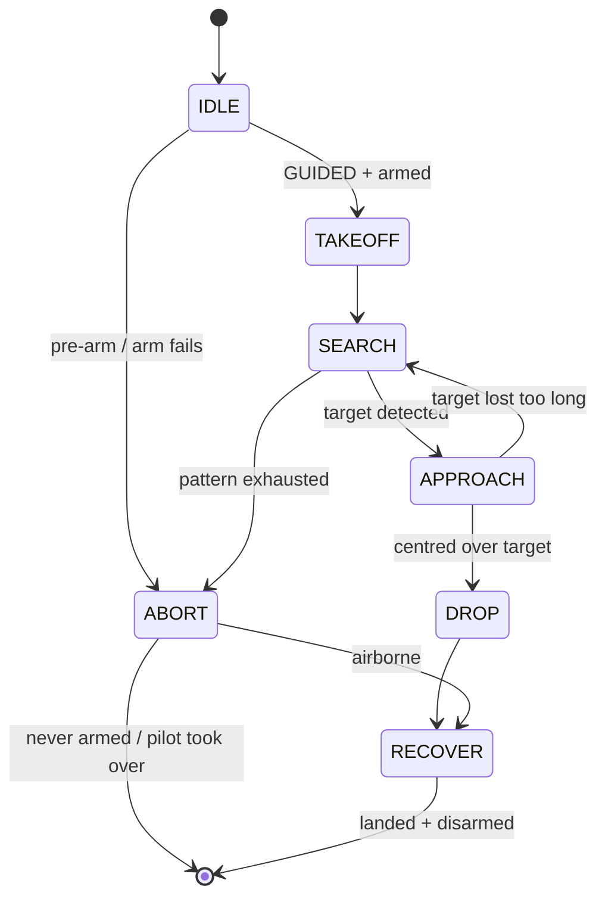

# Mission Planning

"Mission planning" in ArduPilot usually means clicking waypoints onto a map. This
project does **not** do that: the target position is unknown in advance and there is no
GPS indoors, so nothing map-based can work. Instead, the mission *is a program* — a
state machine on the Raspberry Pi companion computer that flies the aircraft in
**GUIDED** mode over MAVLink. This page explains both approaches and why we use the
second.

## The classic way: GCS waypoint missions — and why it does not fit

With Mission Planner or QGroundControl you place waypoints on a map, upload them to
the flight controller, and switch to AUTO: the autopilot flies the list on its own,
finishing with RTL or LAND. It is the right tool outdoors — but every element of it
assumes GPS:

- **Waypoints are lat/lon coordinates.** Without a GPS fix the vehicle has no absolute
  position, so a lat/lon list is meaningless indoors.
- **The target must be known when you plan.** Our delivery pad's position is *not*
  known — finding it is part of the mission.
- **RTL, the standard mission ending, needs GPS** and first *climbs* to `RTL_ALT` —
  indoors, into the ceiling.

A static waypoint list also cannot react: "search until the camera sees the pad, then
centre over it" is a feedback loop, not a route.

## Our way: a companion computer flying GUIDED

The Pi Zero 2 runs the Pi-Code state machine, connected to the FC on SERIAL4
(MAVLink2, 921600 baud; `mavlink-router` forwards the stream to UDP 127.0.0.1:14550).
The autopilot keeps doing what it is good at — stabilisation, position control, its
own failsafes — while the companion streams position targets and reacts to what the
camera sees:

| State | What happens |
|---|---|
| `IDLE` | safety envelope written to the FC, pre-arm sensor checks, GUIDED, arm |
| `TAKEOFF` | climb to search altitude (2 m) and verify the rangefinder tracks it |
| `SEARCH` | fly a pattern, polling the camera at each waypoint |
| `APPROACH` | visual servoing: nudge toward the detected pad until centred |
| `DROP` | open the payload servo (Pi GPIO), confirm |
| `RECOVER` | land in place and disarm — never RTL indoors |

A failsafe monitor (link loss, battery, phase timeouts, position plausibility) runs
before every state and can jump the machine to `ABORT`. If the pilot flips the mode
switch, the companion commands **nothing further** — the human always outranks it.

## Navigating without GPS: local NED and a synthetic origin

Guided navigation indoors uses the **local NED frame**: waypoints are "metres north /
east of the launch point", served by the optical-flow position estimate
(see [Position & Altitude Hold](position-altitude-hold.md)). Two pieces make it work:

- **`SET_GPS_GLOBAL_ORIGIN`** — with no GPS, nothing sets the EKF's origin, and
  without an origin there is no local frame or home position. The companion sends the
  hall's real-world coordinate itself before arming (the real coordinate matters: the
  magnetic declination the EKF assumes comes from it).
- **Search patterns in local NED** — an expanding **spiral** (default) or a
  **lawnmower** sweep, generated as a waypoint list by `search.py` and flown with
  `stop_and_look` cadence (pause at each point, poll the camera) or `continuous`
  polling. The final approach uses body-frame offsets ("0.3 m forward, 0.2 m right")
  computed from the camera's pixel offsets.

## Staged bring-up: milestones 1–5

The full mission has four unknowns at once — position hold, detector, search pattern,
release. Each milestone adds exactly one, so a failure names its own cause:

| Milestone | Flies | Adds | Pass condition |
|---|---|---|---|
| 1 | climb to 1 m, hold, land | position hold | drift of centimetres, not metres |
| 2 | hover over the pad, detector logging only | the detector | correct `dx/dy` **sign** |
| 3 | the search pattern, no detector | the pattern | pattern completed, ends `TARGET_NOT_FOUND` — that abort *is* the pass |
| 4 | search + detect + centre, no drop | the approach | centred, "releasing NOTHING" |
| 5 | the full delivery | the release | drop confirmed |

Milestone 1 can start from the pilot's hands (`--takeover`) instead of the ground —
see the [on-ground deadlock](position-altitude-hold.md#the-on-ground-deadlock-and-the-pilot-takeover).

## Rehearsed in SITL first

Every mission and every milestone runs against the ArduPilot **SITL** simulator before
it goes anywhere near hardware — same code, one flag (`python main.py --sim`; without
the flag the *real-aircraft* profile runs, deliberately, so a forgotten flag fails on
the safe side). SITL is configured to mimic the indoor sensor suite (simulated optical
flow + rangefinder, GPS off, origin set by the companion), so the entire
search → approach → drop sequence has been flown green in simulation on the same
ArduCopter 4.6.3 the aircraft runs. The full simulation→hardware transition is
documented in the Pi-Code repo (`docs/SIM_TO_REAL.md`).

!!! info "Status"
    The mission logic, failsafes and SITL rehearsals of all five milestones are done
    and green in simulation. **None of the milestones has flown on the real aircraft
    yet** — the drone is grounded pending the post-crash barometer/I2C repair
    ([incident report](../problems/incident-analysis-2026-08-21.md)), and sensor/camera mounts
    are still to be built.
