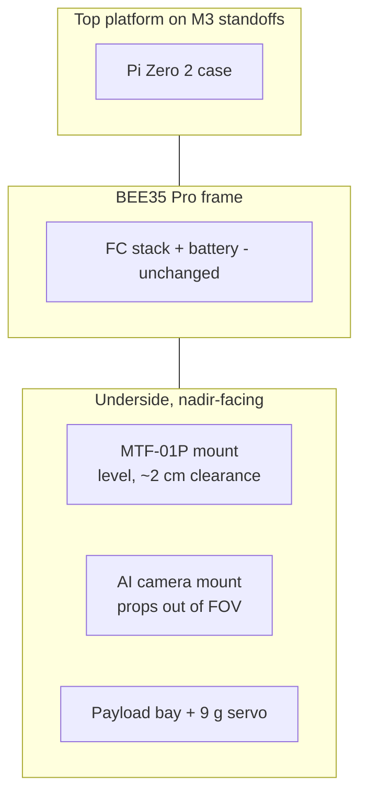

# Frame Extension

!!! info "Status: design phase"
    Requirements and constraints are documented (this section), the actual CAD work is
    still open — see [CAD Models](cad-models.md) for the per-mount design requirements
    and [Print Guide](print-guide.md) for the printing workflow. Nothing has been
    printed or flown yet.

The stock [SpeedyBee BEE35 Pro](../hardware/drone/InitialSetup.md) is a bare 3.5"
CineWhoop: it carries the FC stack, motors, ducts, the analog FPV camera and the
battery — and nothing else. For the delivery mission, four additional components have
to be attached to the frame, none of which have an off-the-shelf mount:

| # | Component | Function | Mounting requirement |
|---|-----------|----------|----------------------|
| 1 | [MicroAir MTF-01P](../hardware/mtf-01p.md) | Optical flow + LiDAR — the *only* horizontal position source indoors | Looking **straight down**, level, free optical path, ~2 cm ground clearance that must stay clear |
| 2 | [Raspberry Pi AI Camera](../hardware/ai-camera.md) (IMX500) | Detects the landing pad on-sensor | Nadir (straight-down) view, props and frame outside the field of view |
| 3 | Drop mechanism + payload bay | Releases the delivered object ([servo mechanism](../delivery-system/servo-mechanism.md)) | Holds a 9 g servo rigidly, payload centred under the frame |
| 4 | [Raspberry Pi Zero 2 WH](../hardware/raspberry-pi.md) case | Companion computer running the state machine | Protected, accessible USB/GPIO, short cable runs to FC and camera |

For attachment we have **M3 standoffs and screws (M3x9 and M3x12)** provided, intended
for a platform that stacks onto the frame's existing M3 pattern. All custom parts will
be 3D-printed (see [Print Guide](print-guide.md)).

## Why the mounts are on the critical path

The drone is currently not flightworthy (see the
[incident report 2026-08-21](../problems/incident-analysis-2026-08-21.md)), but even once the
FC repair is done, **milestones cannot be flown without these mounts**: the MTF-01P
provides the EKF's velocity estimate, the AI camera provides the target, and the drop
mechanism is the mission. The mounts are therefore Task 6 of the project plan and the
main remaining hardware work besides the crash repair.

## Hard constraints from the platform

**Mass.** A 3.5" CineWhoop with Gemfan D90-5 props and Emax Eco II 2004 motors has
very little thrust margin once the 4S Li-Ion pack, the Pi, the camera, the sensor and
a payload are aboard. Every printed part must be as light as rigidity allows — this
drives the wall/infill choices in the [Print Guide](print-guide.md).

**Centre of gravity.** The [initial setup guide](../hardware/drone/InitialSetup.md)
already lists an off-centre CG as a classic cause of drift and yaw-on-takeoff. The
payload bay and battery must stay centred; the Pi and sensor mounts should be placed
to balance each other rather than all hanging off one end.

**Sensor placement is a safety issue, not cosmetics.** The crash analysis showed how
unforgiving bad height/position sensing is on this aircraft:

!!! warning "MTF-01P: nothing may ever slide under it"
    The MTF-01P must keep a free optical path to the floor with roughly **2 cm of
    ground clearance kept permanently clear** — no cable, strap, landing foot or
    payload may ever intrude, on the ground or in flight. The rangefinder reads down
    to a few centimetres (`RNGFND1_MIN_CM = 1`); an object under the lens produces a
    confidently wrong range and a wrong optical-flow scale. During the
    [2026-08-21 incident](../problems/incident-analysis-2026-08-21.md) the MTF-01P itself
    performed flawlessly — the mount must not be the thing that breaks that.

!!! danger "Mounts must survive contact — the GPS mast did not"
    In the crash the GPS module was torn off, and its damaged wiring is the prime
    suspect for taking down the FC's single I2C bus (barometer *and* compass).
    Externally mounted electronics on this frame must either sit inside the frame's
    protective outline or break away without ripping their wiring out of the FC.

**Downwash.** The ducted props produce strong downwash that already disturbs the
barometer near the ground (4–6.7 m baro spikes at ~15 % throttle in the crash logs).
The camera and MTF-01P sit in this airflow; mounts should not add loose flaps, and
cables need strain relief so they cannot flutter into a sensor's view.

## The four mounts at a glance

The concrete dimensioning, the Tinkercad workflow and the pre-flight validation
checklist for each mount are documented in [CAD Models](cad-models.md).

## Open work

- [ ] CAD models for all four mounts (requirements are fixed, geometry is not)
- [ ] Test prints and fit checks ([Print Guide](print-guide.md))
- [ ] Weigh the finished parts and re-check CG before the first flight
- [ ] Verify sensor placement against the [pre-flight checklist](cad-models.md#validation-checklist-before-flight)
