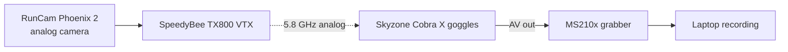

# Radio Controller & FPV System

Two independent radio links leave the aircraft: the **control link** (ELRS,
pilot's sticks in, telemetry out) and the **video link** (analog 5.8 GHz FPV).
They share nothing — the FPV feed can die while the pilot keeps full control,
and vice versa. This page covers both chains and the one safety setup that must
happen before any flight: a disarm switch on the transmitter.

## Control link: ELRS

| Component | Part | Firmware |
|---|---|---|
| Transmitter | Radiomaster GX12 | EdgeTX 2.11.5 |
| Receiver | Radiomaster XR4 Gemini Xrossband dual-band ELRS | ExpressLRS 4.0.0 |

ExpressLRS (ELRS) is an open-source long-range RC protocol. The XR4 is a
*Gemini dual-band* receiver: it listens on two bands simultaneously for
diversity, which helps in an indoor hall full of reflections. Transmitter and
receiver firmware should stay on matching ELRS major versions — mixed major
versions will not bind.

!!! info "Legal note (Germany)"
    Both the ELRS control link (when using the 868 MHz band) and the analog
    5.8 GHz video transmitter are subject to legal transmit-power limits in
    Germany. Check the current Bundesnetzagentur regulations and configure the
    output power of both links accordingly before transmitting.

### Binding phrase scheme

ELRS binds via a **binding phrase** (a passphrase hashed into the ELRS
firmware/config) instead of a button-press pairing. Our teams use the scheme:

```
drone1ffm, drone2ffm, drone3ffm
```

one phrase per team's drone. Set the same phrase on the GX12 (ELRS Lua script /
transmitter module config) and in the XR4's ExpressLRS configuration. With
distinct phrases, three drones can fly from three transmitters in the same room
without cross-binding — but it also means a transmitter can *only* control the
drone whose phrase it carries.

### Receiver to FC: CRSF

The XR4 connects to a flight-controller UART and speaks **CRSF** (Crossfire
serial protocol) — a bidirectional protocol carrying stick channels *to* the FC
and telemetry (battery voltage, flight mode, link quality) *back* to the
transmitter. On our aircraft it sits on SERIAL2 with `SERIAL2_PROTOCOL = 23`
(RCIN); the baud rate is auto-detected. Two extra settings from
[Initial Setup](./drone/InitialSetup.md) matter for ELRS:

| Parameter | Value | Why |
|---|---|---|
| `RSSI_TYPE` | 3 | Read link quality/RSSI from the CRSF telemetry stream |
| `RC_OPTIONS` bit 13 | set | "Use 420 kbaud for ELRS" — the baud rate ELRS receivers actually use |
| `RC_OPTIONS` bit 9 | set | "Suppress CRSF mode/rate message for ELRS systems" |

Set the bits via *Config → Full Parameter List → RC_OPTIONS → Set Bitmask* in
Mission Planner; the full walk-through with screenshots is in
[Initial Setup](./drone/InitialSetup.md).

## Safety: set up a disarm switch first

!!! danger "Configure a kill/disarm switch BEFORE the first flight"
    Map a dedicated transmitter switch to **motor disarm** (ArduPilot
    `RCx_OPTION = 81` "Disarm", or `31` "Motor Emergency Stop") and test it on
    the bench with props off. This switch is the last line of defense when the
    aircraft misbehaves — and our companion computer's software failsafe is
    **not a substitute** for it: the companion talks to the FC over MAVLink and
    can itself hang, lose its serial link, or be the *cause* of the problem.
    Only the direct RC link lets the pilot cut the motors independently of
    everything else on the aircraft. The companion's `--takeover` pilot
    handover assumes exactly this: a pilot on the GX12 who can always override
    or kill.

    A three-position switch is also reserved for flight modes
    (`FLTMODE_CH`, see [Initial Setup](./drone/InitialSetup.md)) so the pilot
    can drop from GUIDED back to a manual mode at any time.

## Video link: analog FPV chain



| Component | Part | Notes |
|---|---|---|
| Camera | RunCam Phoenix 2, 1000TVL, 155° FOV | Analog CVBS output |
| VTX | SpeedyBee TX800 | Controlled by the FC via **IRC Tramp** on SERIAL3 |
| VTX antenna | TrueRC Singularity 5.8 GHz RHCP (SMA) | |
| Goggles | Skyzone Cobra X | Analog 5.8 GHz diversity receiver |
| Recorder | MacroSilicon MS210x AV grabber | USB video capture of the goggles' AV output |

The chain is fully **analog**: the Phoenix 2 outputs a composite video signal,
the TX800 puts it on a 5.8 GHz channel, and the Cobra X receives it. Analog
video degrades gracefully (static instead of freezing), which is why it is
still popular for FPV piloting.

- **VTX control:** the TX800 is wired to a FC UART running the **IRC Tramp**
  protocol (SERIAL3), so band, channel and power can be changed from the radio
  or ground station instead of button sequences on the VTX itself. Keep the
  transmit power at the legal/minimum setting indoors — the receiver is meters
  away.
- **Recording:** the Cobra X has an AV output; plugging the **MS210x grabber**
  into it turns any laptop into a DVR, so test and demo flights can be
  recorded exactly as the pilot saw them. The grabber shows up as a standard
  UVC webcam (usable with VLC, OBS or QuickTime).

Note that this FPV camera is *only* for the human pilot. The AI object
detection uses a completely separate camera on the companion computer — the
[Raspberry Pi AI Camera](./ai-camera.md).

## Related pages

- [Initial Setup](./drone/InitialSetup.md) — serial port configuration
  (receiver on SERIAL2, VTX on SERIAL3), radio calibration, flight modes
- [Drone (Frame & FC)](./drone.md) — full UART map of the flight controller
- [Hardware overview](./index.md) — everything each team receives
