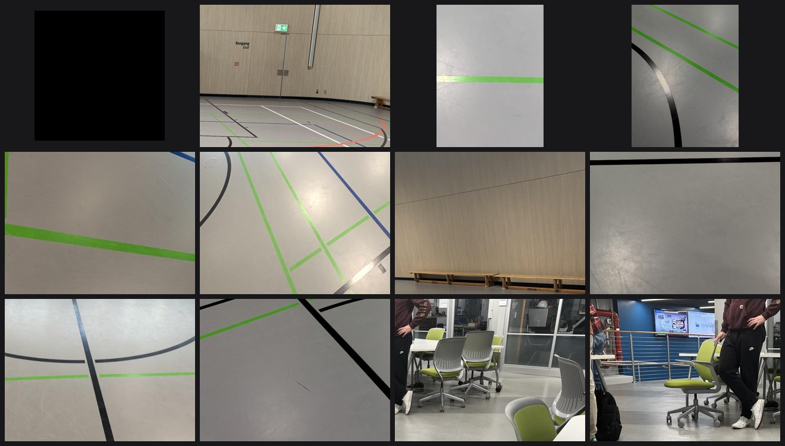
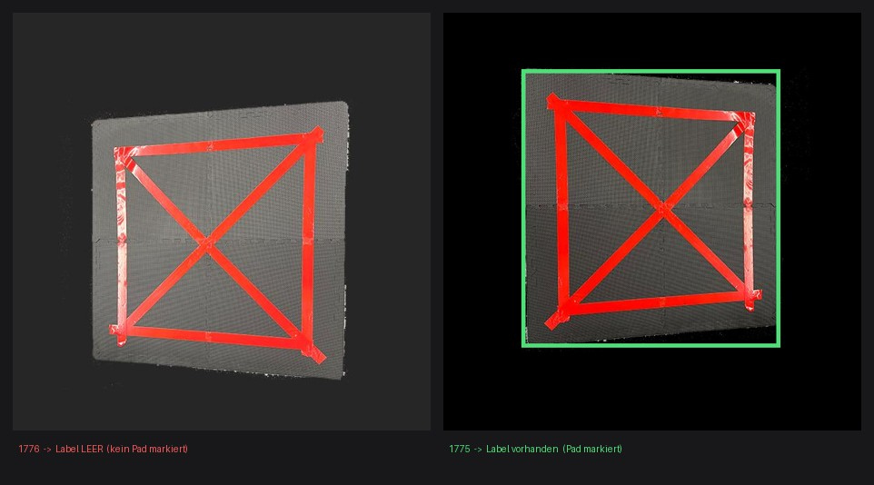
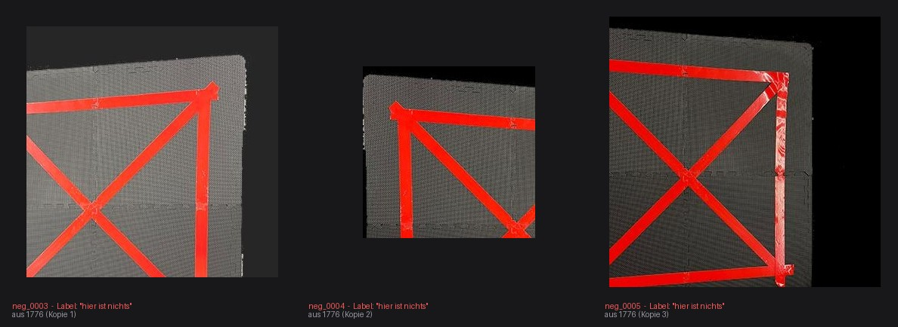
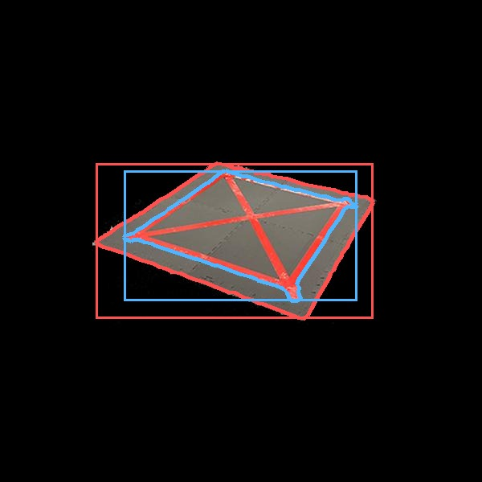

---
tags:
  - ai
  - landing-pad
---

# The pictures we trained on

!!! abstract "In short"
    We trained on **123 photos**. Only 46 are ours — taken in the sports hall. The
    other 77 we downloaded, and that is the reason our pad looks the way it does.

    The photos arrived badly sorted, in a way that let the model cheat. We re-sorted
    them.

    We also added 76 pictures with **no pad in them at all**. That sounds pointless.
    It was the most useful thing we did.

## Where the pictures came from

Two places.

**77 photos we downloaded.** There is a free collection on the internet,
[`cgomolak/landing-pad-zvclx`](https://universe.roboflow.com/cgomolak/landing-pad-zvclx),
of a landing pad already marked up by somebody else. It shows a dark foam mat with red
tape around the edge and red tape across the diagonals — 38 pictures of it floating on
a black background, and 39 close-ups on an office carpet.

**46 photos we took ourselves**, of our own pad lying on the sports hall floor.

| Where the photos come from | How many | What they show |
|---|---|---|
| Downloaded | 38 | the pad on a black background, cut out of any room |
| Downloaded | 39 | the pad on an office carpet, close up |
| **Ours** | **46** | **the pad on the sports hall floor** |

So **63 % of the pictures are not ours**, and they show places the drone has never
been.

### Why we took the hall photos

Because the downloaded pictures do not show the floor the drone flies over. A sports
hall floor is grey, shiny, painted with coloured lines and lit from above. An office
carpet is none of those things, and a black background is not a floor at all.

So we built a pad that matches the downloaded one, put it on the hall floor, and
photographed it. Those 46 pictures are the only ones in the whole set that show the
real working environment.

!!! warning "The place that matters is the smallest part of the collection"
    The hall is where the drone flies. It is **37 %** of the pictures. The rest is a
    room we have never flown in, plus a background that does not exist anywhere.

    Keep that in mind whenever a later page says the model "copes well".

### Why our pad looks the way it does

We copied it. Building our pad to match the downloaded one meant we could use all 77
of those already-marked-up pictures instead of photographing and marking up everything
ourselves.

For a semester project that was clearly the right trade: 46 photos of our own became a
123-photo collection, and it saved roughly two thirds of the marking-up work.

It has two consequences, and it is better to write them down than to be surprised by
them later:

**1. A third of the pictures show something the drone will never see.** A pad floating
on a black background is not a floor.

**2. We cannot say whether the model would recognise a *different* landing pad.** Every
picture we have — the ones we train on and the ones we test with — shows this one pad,
because we deliberately built ours to match. There is no picture of any other pad to
test against.

That is not an oversight. It follows from how the collection was put together, and no
amount of testing with *these* pictures can answer it. For our project it barely
matters: the drone lands on this pad. It would start to matter if the pad were ever
rebuilt differently.

??? note "Attribution and licence"
    The black-background pictures come from
    [`cgomolak/landing-pad-zvclx`](https://universe.roboflow.com/cgomolak/landing-pad-zvclx),
    licensed **CC BY 4.0**. Our merged version is
    [`amir-ebrahimi/landing-pad-zvclx-gs3dc`](https://universe.roboflow.com/amir-ebrahimi/landing-pad-zvclx-gs3dc).
    Everything was marked up again as outlines rather than plain rectangles, and
    exported in the format the training tool expects.

## The sorting problem

Before training, a picture collection is split into three piles:

- one to **learn** from,
- one to **check progress** on while learning,
- one to **grade** the finished model with.

The grading pile has to contain pictures the model has genuinely never seen. Otherwise
you are not testing whether it learned anything — you are testing whether it can
remember.

Our piles were mixed up, for two reasons at once.

**Reason one: hidden copies.** The export contains 295 images, but they come from only
123 photos. The tool automatically made **three altered versions of every photo** —
mirrored, slightly brighter or darker, slightly blurred. Sorted at random, version 1
ends up in the learning pile and version 2 in the grading pile. Same photo, barely
changed.

**Reason two: burst photos.** Our own hall pictures were taken as rapid sequences, a
few centimetres apart. Photo 12 and photo 13 are nearly identical. Randomly sorted, one
lands in each pile.

!!! warning "This is why the first score of 0.94 meant nothing"
    The model was being graded on pictures it had effectively already studied. The
    score measured its memory, not its ability.

**The fix.** `build_dataset.py` sorts by **blocks** rather than at random: a whole
stretch of a sequence goes to one pile, and the few photos on either side of the cut
are thrown away entirely, so nothing near-identical straddles the boundary.

```bash
python3 build_dataset.py      # 175 to learn from / 25 to check / 16 to grade
```

!!! note "Why we did not simply re-grade the old models"
    The old models score well on the new piles too — but only because they were
    originally trained on those exact pictures. There is no untouched picture left to
    grade them with. So [Training](training.md) starts the old settings again from
    scratch, which is the only way to get comparable numbers.

## What the collection is biased towards

| Property | Value | What it causes |
|---|---|---|
| Typical pad size in the picture | **78 % of the image width** (measured across the 172 training pads) | the model has almost never seen a pad far away — though at the 2 m search height it appears at about 38 %, which is still a size it handles perfectly ([why](evaluation.md#height-where-the-old-settings-broke)) |
| Camera position (all photos) | handheld, at an angle | **never seen from straight above — which is exactly how the drone's camera is mounted** |
| Pictures with no pad | **0 of 175** | "there is nothing here" was never a possible answer |
| Pictures on a black background | 31 % | a view the drone will never have |

Row one causes the problem described in [Evaluation](evaluation.md). Row three causes
the one in [Training](training.md#the-false-alarm-lesson).

## The pictures with nothing in them

Row three above is the important one, so we fixed it: we added 76 pictures containing
no pad.

<figure markdown>
  { width="720" }
  <figcaption>Twelve of the 76, taken evenly across the whole set: hall floor, painted lines, a wall, an office — and one plain black background, cut from the downloaded photos. No pad anywhere.</figcaption>
</figure>

These are not new photographs. They are **cut-outs of pictures we already had** — ours
and the downloaded ones — taken from parts of the frame where there is no pad: floor,
painted lines, shadows, skirting boards. Each one is given to the model with an empty
answer sheet: *this picture contains nothing*.

Three of the 76 are **not** like this, and that is
[the mistake described below](#a-mistake-we-found).

```bash
python3 negatives.py          # 76 cut-outs -> 30 % of the pictures are now empty
```

That brings the collection to 251 pictures, of which 30 % contain no pad. It turned out
to be the single most valuable change in the project — the reason why is on the
[Training](training.md#the-false-alarm-lesson) page.

## A mistake we found

Checking the collection, three empty answer sheets turned out not to be empty pictures.

<figure markdown>
  { width="640" }
  <figcaption>Left: photo 1776, answer sheet empty. Right: its neighbour 1775, correctly marked in green.</figcaption>
</figure>

Photo **1776** shows the pad filling most of the frame — and nobody ever marked it up.
It is the only such mistake in all 295 images; every neighbouring photo is marked
correctly. The automatic copying then turned that one oversight into three pictures.

**And it spread further.** The tool that cuts out the empty pictures avoids any area
where a pad is **marked**. On 1776 nothing was marked, so nothing was avoided — and
three cut-outs were taken straight out of the pad and filed as "nothing here":

<figure markdown>
  { width="720" }
  <figcaption>These three were traced back to photo 1776 by matching them pixel for pixel.</figcaption>
</figure>

These are worse than the original mistake. They are close-ups of exactly what the model
is supposed to look for — red tape on a dark mat — labelled "nothing here".

**Altogether: 6 of 251 pictures (2.4 %) teach the model that a clear pad is nothing.**
One missed marking, multiplied twice: first by the automatic copying, then by the
cut-out tool.

Whether that measurably harmed the finished model, we do not know — finding out would
mean training again without them and comparing.

!!! tip "How to fix it, in a few minutes"
    Mark up 1776 in Roboflow, export again, and re-run `negatives.py`. The cut-out tool
    will then avoid the pad by itself. Worth doing before the next training run.

    The separate set of 91 pictures used to *measure* false alarms is **not** affected —
    it is built from the other two piles, and 1776 is in the learning pile. The measured
    figure of 0.02 false alarms per picture still stands.

## We checked every single picture

After finding that one, we checked all of them mechanically: is there an answer sheet,
is it readable, are the coordinates sensible, is the box a plausible shape, are there
duplicate pictures across the piles, and does the red tape actually fall inside the
marked area. Everything the checks complained about was then looked at by eye.

| Check | Result |
|---|---|
| Missing or wrongly empty answer sheet | **1 photo** — 1776, above |
| Unreadable, wrong category, impossible coordinates | none |
| The same picture in two different piles | none |
| More than one pad marked in one picture | **1 photo** — 1761, below |
| Very long, thin boxes | 26 pictures — **all correct**, the pad seen almost edge-on really is that shape |
| Marked area contains hardly any red | 1 picture — **correct**, the pad is far away and only a few pixels across |
| Lots of red *outside* the marked pad | 65 pictures — **all correct**, those are the hall's painted floor lines |

That last row is interesting on its own: **in two thirds of our hall photos, most of the
red in the picture is not the pad.** It is the floor. Worth knowing before assuming that
"there is red here" says anything about where the pad is.

### The double marking (1761)

One picture has the same pad outlined **twice** — once loosely around the edge of the
mat, once tighter along the red tape:

<figure markdown>
  { width="420" }
  <figcaption>One pad, two outlines: red follows the mat's edge (71 points), blue follows the tape (68 points).</figcaption>
</figure>

The answer sheet then expects two pads where there is one, so a model that correctly
finds the single pad gets marked down for missing the other.

It changes nothing here. That picture sits in a pile our re-sorting threw away
entirely — it appears in none of the training sets — so no training run ever saw it and
no measurement includes it. It is recorded so that it does not quietly come back with
the next export.

The check can be repeated after any new export:

```bash
python3 audit_dataset.py
```

## What did not work: fake pictures

`synth.py` pastes small pads onto photos of real floors, to fake the distant views the
collection is missing. It made 124 extra pictures. They improved how tightly the model
draws its box, but made it *worse* at the hard cases they were meant to fix.

The fakes look convincing to a person. They are evidently no substitute for actually
walking further away and taking a photo.

## The scripts

| File | What it does |
|---|---|
| `build_dataset.py` | re-sorts the piles so the model cannot cheat |
| `negatives.py` | cuts out the pictures with no pad in them |
| `audit_dataset.py` | checks every picture and answer sheet |
| `synth.py` | makes the fake distant pictures (the attempt that did not pay off) |
| `build_2class.py` | merges pad and person pictures (see [Training](training.md#a-short-detour-spotting-people-too)) |
