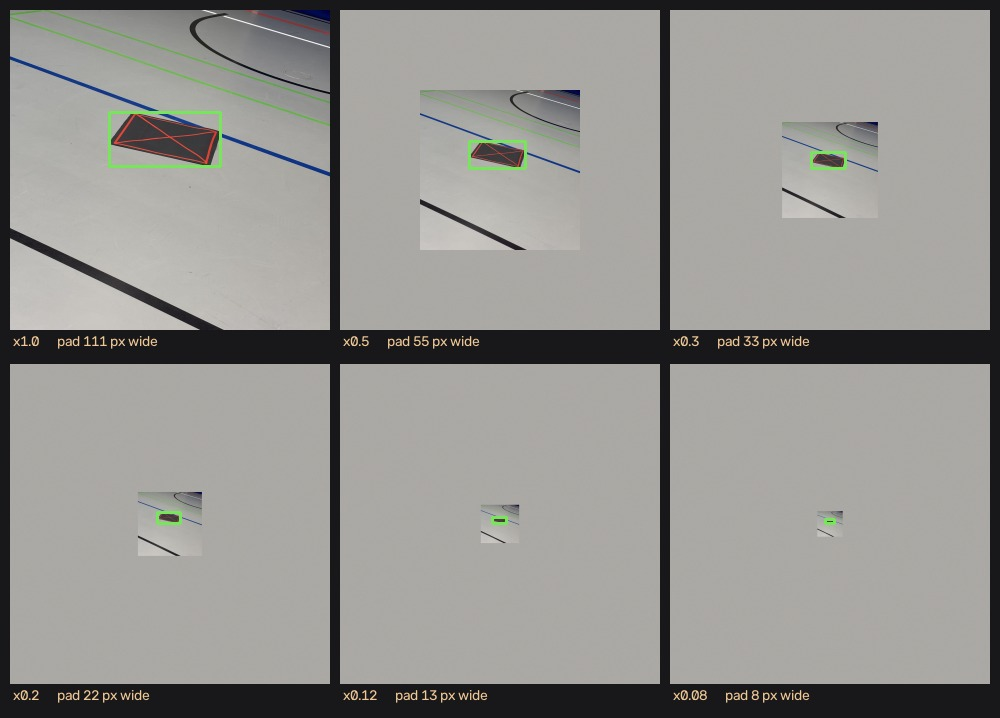

---
tags:
  - ai
  - landing-pad
---

# How we tested it

!!! abstract "In short"
    The usual way of grading a detector gave all six of our attempts almost the same
    result — about 0.995 out of 1. That told us nothing about which was better.

    So we tested differently: we deliberately ruined the test photos the way real
    flying ruins them — turned sideways, pad shrunk to a few pixels, motion blur — and
    asked which model still coped. That separated them immediately.

    Later, running on the actual camera, we found something no laptop test could have
    shown.

## Why the usual grade was useless

After re-sorting the pictures we trained the **old** settings again as a baseline. It
scored **0.995**. The new settings scored **0.995**. So did the other four attempts.

The grade had run out of room. Our grading pile is 16 photos of one high-contrast pad
on a clean floor — too easy for the difference between two models to show up at all.

So we made our own tests, based on what actually happens in flight:

=== "Turning"

    A drone does not hold a fixed heading, so the pad arrives at the camera rotated.
    We rotate the photos, and rotate the marked outlines with them so the correct
    answer stays exact.

=== "Height"

    Higher up means fewer pixels on the pad. We shrink the whole photo onto a
    floor-coloured background, which makes the pad small in exactly the way climbing
    does.

    <figure markdown>
      { width="760" }
      <figcaption>One hall photo at the six levels, shown at the size the model actually receives (320 px). The green box is the correct answer.</figcaption>
    </figure>

    You can see the limit of the trick as well: the surroundings shrink with the pad and
    are replaced by flat floor colour. A real photo taken from higher up would show more
    floor, more lines, more clutter. The test makes the pad small honestly; it does not
    reproduce everything else about being higher up.

=== "A moving camera"

    Motion blur from the propellers, sensor noise, and compression — applied at the
    size the model actually sees.

## Height: where the old settings broke

How often the model finds the pad as it gets smaller in the picture. `1.00` means it
found every one.

| Pad width the model sees (median) | 296 px | 148 px | 89 px | 59 px | 35 px | 24 px |
|---|---|---|---|---|---|---|
| A (old settings) | 1.00 | 1.00 | 0.81 | 0.69 | **0.50** | **0.25** |
| D (new settings) | 1.00 | 1.00 | 0.94 | 0.81 | 0.75 | 0.62 |
| **F** (what we use) | 1.00 | 1.00 | **1.00** | **0.94** | **0.81** | **0.69** |

The old settings **lose half their detections** by the time the pad is 35 pixels across.
The model we deployed still finds four out of five.

The cause is in the pictures, not the training: the typical training pad fills
[78 % of the image width](dataset.md#what-the-collection-is-biased-towards), because
every photo was taken standing next to it.

!!! note "The pixel row is a median, and the set is split in two"
    The 16 grading photos are not one population. Ten of them are close-ups — the
    black-background shots and the office ones — where the pad fills 89 to 99 % of the
    frame. The other six are hall photos, where the pad is between 9 and 66 %, median
    **80 px**.

    So the hall photos already start where the close-ups only arrive after shrinking by
    about a third. The illustration above is one of the hall photos, which is why its pad
    is 111 px and not 296. When reading the table, remember that the columns to the right
    push the *hall* photos into single-digit pixel sizes long before the close-ups get
    there.

!!! tip "What these sizes mean in flight"
    The camera's lens covers 66° across, so how big the pad looks follows directly from
    how high the drone is. Taking the pad as roughly a metre across, and using the
    deployed model's own numbers from the row above:

    | Shrink factor | Pad fills | Same as flying at | **F finds it** |
    |---|---|---|---|
    | ×1.0 | 92 % | 0.8 m | 1.00 |
    | ×0.5 | 46 % | 1.7 m | 1.00 |
    | — | **38 %** | **2 m — the search height** | **between the two rows above: 1.00** |
    | ×0.3 | 28 % | 2.8 m | 1.00 |
    | ×0.2 | 18 % | 4.2 m — about the indoor limit | 0.94 |
    | ×0.12 | 11 % | 6.9 m | 0.81 |
    | ×0.08 | 7 % | 10.4 m | 0.69 |

    **The drone cannot fly high enough to reach the weak part of this table.** It
    searches at 2 m and may not exceed 4 m indoors — the top half of the table. The
    bottom two rows describe heights this aircraft never reaches.

    That does not make the test pointless: it is what chose the settings, and it is the
    right test for any future outdoor use. It does mean the weakness should not be read
    as a problem for the current mission.

??? note "All five attempts, at every size"
    | | ×1.0 | ×0.5 | ×0.3 | ×0.2 | ×0.12 | ×0.08 |
    |---|---|---|---|---|---|---|
    | Median pad size (px) | 296 | 148 | 89 | 59 | 35 | 24 |
    | A (old) | 1.00 | 1.00 | 0.81 | 0.69 | 0.50 | 0.25 |
    | B | 1.00 | 1.00 | 1.00 | 0.94 | 0.69 | 0.56 |
    | C @416 px | 1.00 | 1.00 | 0.94 | 0.81 | 0.38 | 0.00 |
    | **D** | 1.00 | 1.00 | 0.94 | 0.81 | **0.75** | **0.62** |
    | E | 1.00 | 1.00 | 0.88 | 0.62 | 0.69 | 0.62 |

## Everything at once: a real approach

Rotated *and* far away *and* blurred — which is what the camera sees coming in.

| | rotated 45°, distant | + blur | rotated 135°, further, everything | rotated 90°, furthest, everything |
|---|---|---|---|---|
| A (old) | 0.44 | 0.44 | 0.06 | **0.00** |
| **D** | **0.94** | **0.94** | **0.50** | **0.69** |

The old settings reach **zero** on the hardest case — it finds nothing at all. This is
the table that chose the settings. The usual grade could not have.

## False alarms on empty pictures

The test that changed which model we ship. 91 pictures with no pad in them, none of
which the model had seen:

| | False alarms per picture | Finds real pads | Finds distant pads | Worst confidence on an empty picture |
|---|---|---|---|---|
| A (old settings) | 0.02 | all | 0.81 | 0.55 |
| D | 0.33 | all | 0.94 | **0.87** |
| **F** (what we use) | **0.02** | all | **0.94** | 0.66 |

The full story is on the [Training](training.md#the-false-alarm-lesson) page. The short
version: D was confidently wrong about empty rooms, and no threshold could have caught
it.

## What shrinking the model costs

The model has to be shrunk to run on the camera chip. We measured the cost rather than
assuming it:

| | Finds the pad | Draws a tight box |
|---|---|---|
| Full size, on a laptop | every time | 0.81 |
| Shrunk for the Pi's processor | every time | 0.68 |
| Shrunk for the camera chip | every time | 0.67 |

**Shrinking costs nothing in finding the pad.** It only makes the box a little looser.

!!! note "Careful: this was simulated, not measured on the camera"
    These numbers come from running the shrunk model *on a laptop*. It is a good stand-
    in for what shrinking does to the model — and the next section is where it stops
    being a good stand-in for the real camera.

??? note "The stress tests, full model vs shrunk"
    | Test | Full size | Shrunk |
    |---|---|---|
    | Rotation, worst case | 0.94 | 0.94 |
    | Height, worst case (24 px pad) | 0.69 | 0.69 |
    | Blur / noise / compression | 1.00 | 1.00 |
    | Everything at once, worst case | 0.62 | 0.69 |
    | mAP50 | 0.995 | 0.995 |

## Choosing how sure the model has to be

The model reports a confidence with each detection. Below a chosen threshold we throw
the detection away. Where to put the threshold:

| Threshold | 0.25 | 0.40 | **0.50** | 0.60 | 0.70 |
|---|---|---|---|---|---|
| False alarms per picture | 0.03 | 0.03 | **0.02** | 0.00 | 0.00 |
| Finds real pads | all | all | **all** | 0.94 | 0.81 |
| Finds distant pads | 0.94 | 0.88 | **0.88** | 0.75 | 0.56 |

**0.50 is nearly free.** It still finds every pad in the grading pile, and costs one
distant pad in sixteen compared with a much lower threshold. Going to 0.60 is where it
starts genuinely missing things.

## What the real camera does differently

The laptop simulation is honest about *whether* the model finds the pad. It is not
honest about *how sure* the model says it is.

On the actual camera chip, confidence only ever comes back in fixed steps of about 0.06:

```
0.32   0.38   0.44   0.50   0.56   0.62   0.68   0.73   0.78
```

Two things follow, and no laptop test could have shown either:

**The threshold only has about nine usable settings.** Choosing 0.30 and choosing 0.35
are the same choice — both let the 0.32 step through and there is nothing in between.

**The lowest step is where the rubbish is.** In a live test at threshold 0.3, every
nonsense detection sat at exactly **0.32**: boxes stuck to the edge of the frame, long
thin shapes no pad could make, each lasting a single frame. The real pad sat at **0.50
to 0.78** and stayed there for dozens of frames in a row.

So the table above and the real camera agree, for different reasons: **use 0.50**.

!!! tip "Time separates them better than confidence does"
    The false detections came **one at a time**. The real ones persisted. If you require
    the pad to appear in 3 out of 4 consecutive frames in roughly the same place, the
    noise disappears completely — and a landing controller should never react to a
    single frame anyway.

    Throwing away impossible shapes helps too: anything longer than about 1:3, or
    touching the edge of the frame, cannot be a pad seen from above.

## The scripts

| File | What it does |
|---|---|
| `compare.py` | grades, broken down by pad size and by room |
| `robustness.py` | the rotation / height / moving-camera tests |
| `fp_bench.py` | false alarms on pictures with no pad |
| `person_bench.py` | how well the combined model spots people |
| `pad_pose.py` | outline, centre and angle of a confirmed pad — written, not used by the mission |
