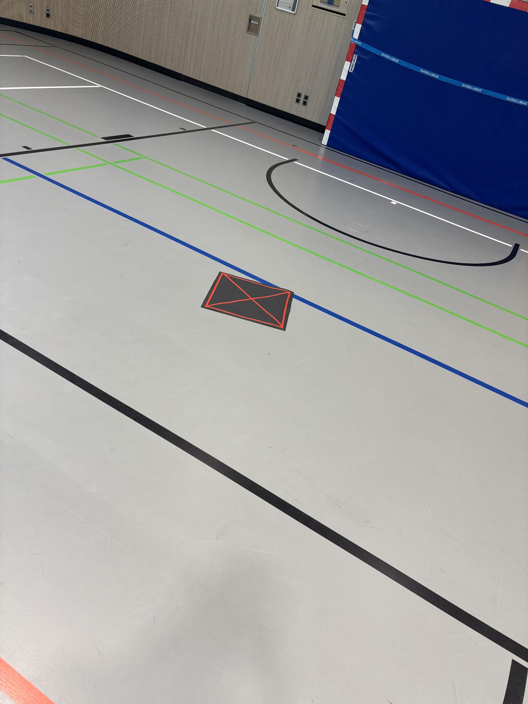

---
tags:
  - ai
  - landing-pad
---

# Landing Pad Detection

## What this is

The drone has to drop a package on a landing pad. Indoors there is no GPS, so it
cannot just fly to a coordinate — it has to **see** the pad with a camera and fly
towards what it sees.

This section is about the software that does the seeing. We trained a small AI model
to answer one question, once per camera picture:

> **Is there a landing pad in this picture, and where?**

The answer is a rectangle drawn around the pad. The flight code turns that rectangle
into something like *"the pad is 1.2 m to your right"* and nudges the drone that way.

That is the whole job. Everything else on these pages is about making that answer
reliable.

!!! tip "New to the vocabulary?"
    These pages use words like *recall*, *quantisation* and *false positive*. Each one
    is explained in one sentence in the **[Glossary](glossary.md)**. You do not need to
    read it first — look things up as you go.

## The pad

<figure markdown>
  { width="480" }
  <figcaption>Our pad in the sports hall — the place the drone actually flies.</figcaption>
</figure>

A dark mat with red tape: a border and a cross from corner to corner.

**We did not design it — we copied it.** A free dataset on the internet already had 77
labelled photos of a pad with exactly this pattern. By building ours to look the same,
we could use those photos for training instead of taking and labelling hundreds of our
own. Details: [Dataset](dataset.md).

Two things follow from the shape, and they come up again later:

- **Turn it 90° and it looks identical.** Good for recognising it, but it means the
  camera can never tell which way round the pad is lying.
- **Red crossing lines are everywhere in a sports hall.** The floor is painted with
  them. So "it has a red cross on it" is not a useful way to double-check a detection —
  we tried, and measured that it does not work.

## How it works, in four steps

1. **Collect pictures.** 123 photos of the pad — some ours from the sports hall, most
   from the free dataset. Every pad is marked by hand so the model knows what it is
   looking for.
2. **Train.** The model looks at the pictures over and over until it can find the pad
   by itself. This takes about 13 minutes on a laptop.
3. **Convert.** The trained model is a laptop file. It has to be repackaged into the
   format the camera chip understands.
4. **Run it on the drone.** The Raspberry Pi AI Camera has a small AI processor
   *inside the camera itself*. The model runs there, not on the Raspberry Pi. That
   matters because the Pi is a slow computer and is already busy flying the drone.

## Does it work?

Yes. Three numbers, and what each one means:

| Number | What it means |
|---|---|
| **16 of 16** | On our test photos — pictures the model had never seen — it found the pad every single time. |
| **2 in 100** | On photos with *no* pad in them, it wrongly claimed to see one about twice per hundred pictures. |
| **runs live on the camera** | Confirmed on the real drone: the model detects the pad in real time and follows it smoothly as it moves. |

The third one is the important one. Everything before it was measured on a laptop; this
one is the actual hardware doing the actual job.

## What it cannot do yet

- **It has never seen the pad from the air.** Every training photo was taken by hand,
  standing up, pointing down. The drone sees something quite different.
- **It has never flown.** The camera detects the pad on a table. Nobody has yet flown
  the drone while it does so.
- **Indoors only.** Grass, asphalt, sunlight — all untested.
- **Only this one pad.** Because we built our pad to match the training data, we cannot
  say whether the model would recognise a *different* landing pad. It might just have
  learned "this exact strip of red tape".

!!! info "Status (2026-08-24)"
    The model is trained, converted, and **running on the camera on the drone**. A
    bench test tracked the pad across dozens of frames and correctly reported "no pad"
    once it was taken away.

    Before it may steer the aircraft, three things are still open — one wrong setting
    in the flight code, a filter against one-frame glitches, and a tape-measure check.
    They are listed on [Flight-Code Integration](integration.md).

## The one thing worth doing next

**Film the pad from the drone while flying, and train on those pictures.**

Every other improvement is small next to this one. The model has only ever seen the pad
from standing height, and the drone looks at it from above and from further away. A few
hundred frames from a real flight recording would be worth more than any amount of
further tuning — and the drone already records video.

## Where to read what

Read them in this order if you want the whole story. Each page starts with a short
summary, so you can stop after the summary if that is enough.

-   :material-database: **[Dataset](dataset.md)**

    ---

    Which pictures we used, where they came from, and why we had to reorganise them
    before training.

-   :material-school: **[Training](training.md)**

    ---

    Six attempts at teaching the model. What helped, what did nothing, and the mistake
    that mattered most.

-   :material-chart-line: **[Evaluation](evaluation.md)**

    ---

    How we tested it — and why the standard test score was useless here.

-   :material-rocket-launch: **[Deployment](deployment.md)**

    ---

    Getting the model onto the camera chip, and the traps along the way.

-   :material-connection: **[Integration](integration.md)**

    ---

    How the detector talks to the flight code, and what is still to fix.

-   :material-book-open-variant: **[Glossary](glossary.md)**

    ---

    Every technical word on these pages, explained in one sentence.

