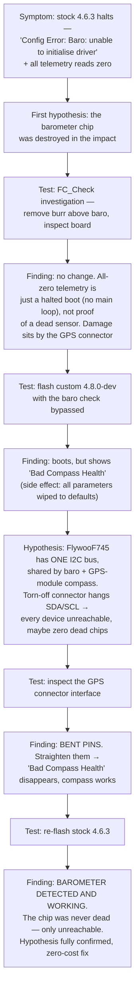

# Crash & barometer recovery (2026-08-21 → 2026-08-24)

This page is the chronological story of the 2026-08-21 crash and everything that
followed it: what happened, why it happened, and the four-day hardware odyssey that
started with "the barometer is destroyed, we need a new flight controller" and ended
with "the barometer was never dead at all". The wrong turns are kept in on purpose —
they are the most instructive part of the whole episode.

For the second-by-second, log-level reconstruction of the crash itself, see the
[full incident analysis](incident-analysis-2026-08-21.md). This page tells the story;
that page carries the evidence.

## What happened

On **21 August 2026**, during a **manual** flight in Stabilize with no companion
script running, the aircraft lifted off, went to full throttle at about one metre of
height, and hit the hall ceiling at **4.8 g**. Nobody was hurt. The aircraft was
grounded on the spot. Two pieces of hardware looked damaged afterwards: the flight
controller no longer detected its **barometer**, and the crash had **torn the GPS
connector off** the board.

The same underlying fault had, in fact, been misfiring for days. Every flight on
2026-08-20 had ended in an uncommanded forced landing, and every re-arm attempt was
refused with `Arm: LAND mode not armable` — which the team misread as a flat battery
at the time. It was not the battery.

## Why it happened

The crash needed **three independent mistakes** to line up. Any one of them, fixed,
would have prevented it:

1. **A leftover geofence.** An earlier companion run had written
   `FENCE_ALT_MAX = 4 m` with `FENCE_ACTION = 2` (always LAND) and died before
   restoring it. FC parameters are persistent, so days later a purely manual flight
   was flying inside an invisible 4 m "always-land" fence. Propeller downwash spikes
   the **barometric** altitude by 4–6.7 m on every takeoff, so the fence breached
   instantly and forced the aircraft into LAND.
2. **A broken EKF height source.** `EK3_SRC1_POSZ = 2` made the rangefinder the
   EKF's *only* vertical position source, and EKF3 never fused a single height from
   it. With no height measurement, the vertical estimate diverged quadratically to
   **−1070 m while the drone stood motionless on the floor**. When the fence forced
   LAND — an altitude-controlled mode — the controller tried to arrest an imaginary
   12.6 m/s descent and saturated the throttle at 100 %.
3. **Disabled arming checks.** `ARMING_CHECK = 0` meant nothing refused to arm a
   vehicle whose vertical estimate was a kilometre off.

The rangefinder itself was **healthy throughout** (good in 3441/3441 samples) — it
was never the problem. The full log-level evidence for all three links, and the fixes
that were landed for each, are on the
[full incident analysis page](incident-analysis-2026-08-21.md). The rest of *this*
page is about the hardware aftermath.

## "We thought the barometer was dead"

After the crash, stock **ArduCopter 4.6.3** refused to finish booting. It halted with:

```
Config Error: Baro: unable to initialise driver
```

The immediate, reasonable conclusion was that the impact had destroyed the barometer
chip. The team ran a hardware investigation, written up in the full protocol
(**[FC_Check.pdf](../assets/FC_Check.pdf)**), which recorded:

- the boot-time **`Config Error: Baro`** message;
- **all telemetry values reading zero** in the ground station — which *looked* like a
  board-wide failure;
- a thin **thread / metal burr** found and removed above the suspected baro chip
  (no change afterwards);
- the observation that the damage sat right next to the **GPS connector**, which the
  crash had torn off.

The all-zero telemetry was the first false lead. It is a natural thing to over-read —
"every value is zero, the whole board must be dead" — but it proved nothing. A flight
controller stuck in a **config-error state never starts its main loop**, so it never
populates or streams any sensor value. The zeros were a symptom of the halted boot,
not evidence about the barometer, the IMU, or anything else.

## The custom no-baro firmware and the sick compass

To get *past* the halted boot and actually see the board's state, a team member built
a **custom ArduPilot 4.8.0-dev** firmware with the barometer check bypassed. It
booted. But Mission Planner now showed a new symptom:

```
Bad Compass Health
```

And flashing the different firmware had an expensive side effect: it **wiped every
parameter to defaults** — including the accelerometer calibration and the MTF-01P
serial setup. (The full pre-crash parameter state had already been recovered from the
crash log's own parameter records, so this was recoverable, but it added a reload step
to the eventual repair.)

So the picture was now: a barometer that would not initialise **and** a compass
reporting bad health. Two sick sensors, not one.

## One bus, one hypothesis

The two symptoms turned out to be the same fault. A look at the **FlywooF745 hwdef**
showed the board has exactly **one I2C bus**, and it is shared by:

- the **onboard barometer**, and
- the **external GPS module's compass**.

That produced a single hypothesis that explained *both* symptoms at once:

> The crash damage at the torn-off GPS connector is holding the shared I2C bus's
> **SDA/SCL lines down**. A hung bus makes **every** device on it unreachable — so
> the barometer looks dead at boot **and** the compass reports bad health, with
> possibly **zero** actually-dead chips.

If that was right, the fix was not a new flight controller — it was repairing the
connector. And the test was free: fix the connector, then look at the sensors again.

## Bent pins — the actual fault

On **2026-08-23** the team inspected the GPS connector interface closely and found
**bent pins**. They straightened them.

Immediately, the **`Bad Compass Health`** warning on the custom 4.8.0-dev build
**disappeared** — the compass (and the GPS) worked again. This was exactly what the
shared-bus hypothesis predicted: bent pins holding SDA/SCL down had made every device
on the single I2C bus unreachable, and freeing the lines brought the compass back.

The compass was recovered. That left one question: was the barometer also just
*unreachable*, or had it genuinely died in the impact?

## Back on stock firmware — the barometer lives

On **2026-08-24** the team re-flashed the previous **stock ArduPilot 4.6.3** — the
same firmware that, four days earlier, had halted at boot with
`Config Error: Baro`.

This time it booted cleanly, and the **barometer was detected and working again**.

The barometer chip had **never been dead**. It had been sitting behind the hung I2C
bus the entire time, unreachable because a few bent connector pins were holding the
bus down. The "destroyed barometer" that had, at one point, been reason to consider
replacing the whole flight controller cost, in the end, **nothing** to fix — just a
careful look at a connector and a pair of tweezers.



## What remains to do

The hardware is recovered, but the crash and the firmware flashing left two chores
before the aircraft flies again:

1. **Reload the parameter baseline** (the custom-firmware flash wiped it). In order:
    - load `Pi-Code/params/fc_baseline_463_20260821.parm` (the full pre-crash state,
      recovered from the crash log's own parameter records),
    - then load `Pi-Code/params/fc_safe_overrides.parm` (the safety overlay: geofence
      off, the mandated `EK3_SRC1_POSZ = 2` with `RNGFND1_GNDCLEAR = 2`,
      `ARMING_CHECK = 786390`, `BATT_LOW_VOLT = 12.8`),
    - then **reboot**.

    The exact procedure is in `Pi-Code/params/README.md` and on the
    [full incident analysis page](incident-analysis-2026-08-21.md).
2. **Recalibrate the compass** after the connector repair, since the compass wiring
   was disturbed and the parameter wipe cleared its calibration.

With those two done, the real-flight milestones are unblocked — see the
[live-demo plan](../results/demo.md) for the staged bring-up.

## What it cost, and what it saved

| Wrong turn | Why it was wrong | What set it straight |
|---|---|---|
| "The barometer chip is destroyed." | It was unreachable behind a hung I2C bus, not dead. | Re-flashing stock 4.6.3 after the connector repair — the baro came back. |
| "All-zero telemetry means the whole board is dead." | A config-error boot never starts the main loop, so it streams nothing regardless of sensor health. | Understanding *why* the values were zero. |
| "We may need a replacement flight controller." | The fault was two bent connector pins on a shared bus. | The one-I2C-bus reading of the hwdef, which produced a free test. |

The lesson that transfers: **one shared bus turns one damaged connector into a
board-wide failure.** When several sensors go quiet at once, suspect what they have in
common — here, the single I2C bus — before you condemn any one chip. The
[board's single I2C bus remains a permanent design limitation](../results/limitations.md)
worth designing around, but on this day it cost nothing but four days of investigation.
