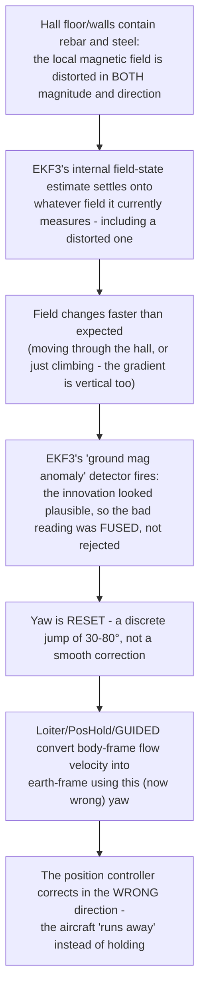

# Loiter drifts in the hall — a compass problem, not a flow problem

On 25 August 2026, Loiter drifted and was abandoned within seconds on all three
attempts flown in the hall, while AltHold in the *same* session was clean (36 s
stable, 0.12 m position excursion). A repeat session on 21 September 2026, flown
purely in Stabilize to stay on the safe side, still shows the identical signature in
the dataflash log, three sudden, large heading jumps, each stamped with the
autopilot's own diagnosis. This page explains the mechanism: why a compass problem
shows up as *position* drift, why an ordinary indoor magnetic field is bad enough to
cause it, and what the logs from both days actually show.

## TL;DR

## What is the EKF yaw estimate?

ArduPilot's state estimator (EKF3, an Extended Kalman Filter) fuses gyroscope,
accelerometer, compass, rangefinder and optical flow into a best estimate of position,
velocity and attitude. **Yaw** is the component of that attitude estimate around the
vertical axis: the compass heading the nose points at, 0–360° usually measured from
north. It is logged as `XKF1.Yaw` in the dataflash log. The estimate is built from two
complementary sources: gyroscope integration, which is smooth and reliable
short-term but drifts without bound over time, and the compass, which gives an
absolute reference but is noisy and — as this page is about — can be *wrong* in a way
gyro integration alone never is.

## Why a yaw error turns into position drift, not just a wrong heading

Stabilize does not use the horizontal position estimate at all — attitude control is
independent of yaw, which is why AltHold and Stabilize stayed clean while Loiter did
not. Loiter, PosHold and GUIDED are different: they hold position using optical flow,
and optical flow only ever measures a velocity **in the airframe's own body frame**
(forward/right). To act on it, the position controller has to rotate that
body-frame velocity into the earth frame (north/east) — and the only angle it has to
rotate by is the EKF's current yaw estimate.

If that yaw estimate is correct, the rotation is correct, and the controller corrects
toward the real error. If yaw is suddenly wrong by 30–80° — exactly what the ground
mag anomaly detector produces, a discrete reset rather than a gradual drift — the
*same* real motion gets rotated into the *wrong* direction. The controller does not
stop correcting; it keeps correcting, just toward a target that does not exist,
and because the resulting position error only grows, so does the (wrong) correction.
That is the walk-away, "toilet bowl" drift signature: not a slow accumulation of
small flow errors, but the position controller confidently steering away from home
because its idea of home rotated out from under it.

## Why the hall's magnetic field has such an outsized effect

Outdoors, the ambient field is essentially just the Earth's field, and over the few
metres a drone moves it barely changes in either magnitude or direction — the compass
is a reliable, near-constant reference. Indoors, reinforced concrete and structural
steel change that completely:

- **Magnitude varies a lot across the flight volume.** Measured in this hall:
  195–565 mGauss, against Frankfurt's Earth field of ~480 mGauss and a hall-floor
  reading of only ~340 mGauss.
- **The gradient is not just horizontal.** A follow-up measurement at a single fixed
  spot, after recalibrating the compass in the middle of the hall, found the field
  climbing from ~360 mGauss on the floor to ~850 mGauss at ~2 m — a **vertical**
  swing larger than the entire Earth field, over the exact height range a takeoff
  climbs through.

**Compass calibration cannot fix this.** Calibration corrects offsets that are fixed
*relative to the airframe* — motor currents, ESC wiring, nearby ferrous parts. A
building's rebar is fixed relative to the *room*, not the drone: the distortion
changes depending on where in the hall the aircraft is, which no per-vehicle
calibration can characterise or remove.

EKF3 continuously estimates the magnetic field itself as part of its state (both the
earth-frame field and the body-fixed offsets), and it carries a **"ground mag
anomaly"** detector: if a live compass reading disagrees with what the filter's
current field model predicts by enough, it treats the *new* reading as more
trustworthy and performs a **yaw reset** — an instantaneous jump, not a filtered
correction. This is meant to catch genuine, abrupt magnetic events (a parked car, a
power line). What defeats it here is scale, not surprise: on 2026-08-25 the EKF's own
innovation ratio for the bad readings peaked at only **0.56**, comfortably under the
rejection threshold, meaning the anomalous reading looked "plausible enough" to the
filter's own consistency check and was fused rather than thrown out. The detector is
tuned for occasional outdoor disturbances; a large, spatially smooth, structurally
caused gradient like this hall's does not look like an outlier from sample to sample,
it looks like the truth having changed.

## When does EKF3 actually start — only after arming?

No. In the 21 September 2026 dataflash log, `EKF3 IMU0 initialised`,
`AHRS: EKF3 active`, `fusing optical flow` and `MAG0 initial yaw alignment complete`
all appear between **7.7 s and 7.9 s** after boot — while the very first `ARM` event
in that log does not happen until **15.9 s**. The estimator starts as soon as the
IMU and compass have enough data to align, runs continuously from boot regardless of
arm state, and keeps fusing the compass the entire time the aircraft sits disarmed on
the ground. Arming is a separate, later gate: ArduPilot's own `ARMING_CHECK` bits and
the companion's `wait_ready_to_arm()` both only *ask* the already-running EKF whether
it currently reports itself ready; neither of them starts it.

## Does sitting on the ground too long make it worse?

This is a reasonable worry, and the mechanism above gives it a concrete answer: yes,
plausibly, but not for the reason "bad values pile up." What happens instead is that
the EKF's internal field-state estimate keeps adapting to *whatever it currently
measures* for as long as the aircraft sits still — including a magnetically
contaminated spot. The longer it sits there, the more confidently the filter's model
settles onto that local, distorted field as if it were ground truth. That settled
model then becomes the *baseline* the ground-mag-anomaly detector compares every new
reading against.

Given the measured vertical gradient (~360 mGauss at the floor to ~850 mGauss at only
2 m, at one and the same spot), the moment the aircraft actually climbs, the compass
reading changes dramatically from whatever was learned while sitting still — and that
mismatch is exactly what the detector is watching for. This lines up with what the
21 September log actually shows: all three "ground mag anomaly" events fired **while
armed and airborne**, not during the disarmed periods between flights.

!!! success "Confirmed in practice (2026-09-21+)"
    Starting as directly as possible, minimal time spent sitting armed or about to
    arm before climbing, produces a measurably better Loiter than a session where the
    aircraft is left standing first. That is exactly what the settling hypothesis
    predicts: less time for the field-state estimate to lock onto the local, distorted
    reading before the climb exposes the mismatch. It is a mitigation, not a fix — the
    gradient itself is a property of this hall, not of how long anyone waited before
    taking off — but it is now the team's standard operating procedure for this
    building: arm, and go.

## Evidence from the 21 September 2026 session

Six arm/disarm cycles were flown, all logged in Stabilize (no `MODE` change to
AltHold/Loiter/PosHold/GUIDED appears anywhere in this particular log). Three times,
the autopilot logged the same message and the EKF's yaw estimate (`XKF1.Yaw`) jumped
within a single 0.1 s sample:

| Time (log) | Message | Yaw before → after | Jump |
|---|---|---|---|
| 75.19 s | `EKF3 IMU0 MAG0 ground mag anomaly, yaw re-aligned` | 247.5° → 203.7° | ~44° |
| 226.59 s | `EKF3 IMU0 MAG0 ground mag anomaly, yaw re-aligned` | 66.9° → 101.1° | ~34° |
| 351.49 s | `EKF3 IMU0 MAG0 ground mag anomaly, yaw re-aligned` | 119.7° → 152.6° | ~33° |

By the second and third events the EKF's own local-position estimate (`XKF1.PE`) had
already wandered to roughly −14 to −15 m from the origin — a large excursion for an
indoor hall, and, because the whole session was flown in Stabilize (no position
control acting on this estimate), most likely visible only on a ground-station
position display rather than as the aircraft physically flying away under its own
control. This is the same signature already on record from 2026-08-25 (yaw snapped
+83° in about a second against only +50° of gyro rotation, alongside an `ERR COMPASS`
event, and a full 360° yaw sweep at up to 182°/s during one Loiter attempt) — the same
mechanism, reproduced on a different day with the vehicle flown deliberately
conservatively.

## Status

**Root cause understood, and flyable with a mitigation.** Both **AltHold and Loiter
now fly on the real aircraft.** Loiter is good in the lab, away from the hall's
structural steel, and still not perfect in the hall itself, but flyable there with the
"arm and go" procedure above (minimal ground dwell before climbing). Object detection
(the AI camera pipeline) also works. None of this removes the underlying cause: the
magnetic gradient is a property of the hall, and the mitigation only reduces how much
time the EKF's field-state estimate has to settle onto it before the climb exposes the
mismatch.

The mechanism itself is well evidenced (field survey, EKF innovation ratio, two
independent dataflash logs showing the same signature) and consistent with known EKF3
behaviour. Compassless flight was tried in SITL on the same parameter set and
**refused arming** (EKF aiding flapped on and off, *"Need Position Estimate"* on 5/5
attempts), so the compass stays mandatory on this stack, and any further fix has to
make the compass *usable* here, not remove it. Remaining ranked options, for a cleaner
result than "arm and go": field-map a stable takeoff zone away from floor rebar and
walls, compare parameters against a colleague team flying successfully in the same
building, try damping the EKF's magnetic-field learning rate (`EK3_MAG_M_NSE`), and a
hand-lift test isolating whether the disturbance is the building or the aircraft
itself. The companion's own autonomous `--milestone` bring-up flights (GUIDED, not
manually flown) are the next step now that manual AltHold and Loiter are working; see
the [roadmap](https://github.com/ki-drohnen-ss26/Pi-Code/blob/main/docs/ROADMAP.md) in
the companion repo for their current status.
