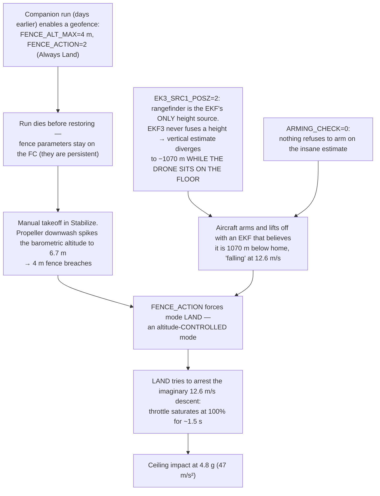

# Incident 2026-08-21 — full-power climb into the ceiling

On 21 August 2026, during a **manual** flight in Stabilize with no companion script
running, the aircraft lifted off, went to full throttle at about one metre of height
and hit the hall ceiling at 4.8 g. Nobody was hurt; the flight controller lost its
barometer and the GPS connector was torn off.

This page is the full post-mortem, reconstructed from the flight controller's own
dataflash logs (five logs across the two test days, 2026-08-20/21). It replaces two
earlier explanations that turned out to be wrong, and it is deliberately detailed:
the failure chain is a textbook case of how indoor, GPS-denied drones fail, and every
link of it is a lesson that transfers to any similar project.

## TL;DR

Three independent mistakes had to line up. Any one of them fixed would have prevented
the crash — which is exactly why each got its own fix (see [What changed](#what-changed)).

## What the logs show, second by second (log 5, the crash flight)

| t (boot time) | Event |
|---|---|
| 15–120 s | Three short arm/disarm cycles (Stabilize hops). EKF altitude already −268 m at t=92 s |
| 184.5 s | Final arming. EKF vertical position **PD = +1070 m** (i.e. 1070 m *below* home), EKF climb rate −12.6 m/s — while the aircraft stands motionless on the floor |
| 187–189 s | Pilot throttles up (~15 %). Rangefinder truthfully tracks the climb: 0.02 → 0.17 → 0.36 → 1.49 → 2.06 m. Barometric altitude spikes under downwash: 0.27 → 2.2 → **6.7 m** |
| 189.1 s | **"Max Alt fence breached"** → autopilot forces **LAND** (`MODE` log: reason `FENCE_BREACHED`). The pilot never left Stabilize by choice |
| 189.3–190.2 s | LAND's altitude controller sees a vehicle "1131 m below target, descending at 11 m/s". "Manual recovery started" appears, but the mode is LAND |
| 190.7–191.9 s | Throttle output saturates at **1.000** (100 %) for ~1.5 s. Rangefinder reads up to 4.94 m — the real climb toward the ceiling |
| 191.7 s | Impact: accelerometer peak **47 m/s² ≈ 4.8 g**. Barometer momentarily reads 14.1 m (pressure shock) |
| 192.2 s | LAND_COMPLETE → auto-disarm. A compass error is logged during the impact |

The same chain, minus the diverged EKF, ran on **every** flight of both days: logs 1–4
all show "Max Alt fence breached" → forced LAND within seconds of takeoff. On those
flights LAND happened to command a descent, the aircraft auto-disarmed, and re-arming
was refused with **"Arm: LAND mode not armable"** — which the team mistook for a
battery problem. It was simply a vehicle still sitting in LAND mode.

## The three links, in detail

### Link 1 — the fence was a leftover, and its action is a mode change

`FENCE_ENABLE=1, FENCE_TYPE=1, FENCE_ALT_MAX=4, FENCE_ACTION=2` were present in all
five logs. They were written by an earlier **companion run** (`Pi-Code`'s
`setup_geofence()`), which is designed to restore them on exit — but battery pulls
and kills ended those runs before the restore. FC parameters are persistent, so days
later a purely manual flight was flying inside an invisible 4 m "Always Land" fence.

The deeper problem is not the number 4: near the ground the **barometer is not usable
as a fence reference**. Propeller downwash raises the local pressure, so barometric
altitude spiked to 4.05 / 4.65 / 5.26 / 4.73 / 6.73 m across the five logs while the
aircraft was centimetres off the floor. A 4 m fence sits *inside the sensor's own
noise band* — it breached on every single takeoff. And a fence whose action is a
**mode change** converts a bad measurement into a manoeuvre nobody commanded.

### Link 2 — the EKF had no height, and had had none on every flight

`EK3_SRC1_POSZ = 2` made the rangefinder the EKF's *only* vertical position source.
EKF3 never fused a single height measurement from it. With no measurement, the filter
integrates accelerometer bias unchecked — the classic unconstrained-INS divergence,
quadratic in time:

| t | EKF altitude |
|---|---|
| 8.6 s | −0.1 m |
| 33 s | −5.8 m |
| 92 s | −268 m |
| 117 s | −452 m |
| 184.5 s (arming) | **−1070 m**, "descending" at 12.6 m/s |

All of that happened **on the ground, before arming**, and it is visible in the very
first seconds. Every altitude-controlled mode (AltHold, Loiter, Land, Guided) chases
this estimate. Stabilize does not — which is why the flight was survivable right up
to the moment the fence forced LAND.

### Link 3 — nothing was allowed to refuse

`ARMING_CHECK = 0`: every pre-arm check disabled. An enabled EKF check refuses to arm
a vehicle whose vertical estimate is a kilometre off. This is the layer that exists
precisely for the day links 1 and 2 line up.

## What was NOT the cause

Two earlier explanations are disproven by the logs, and correcting the record matters:

- **"A cable slipped under the rangefinder / the LiDAR is frozen or defective."**
  The rangefinder reported status *good* in **3441 of 3441 samples** across all five
  logs, and during the fatal climb it tracked truthfully (0.02 → 4.94 m and back down
  through the tumble). A constant 0.02 m *at rest* is the correct reading for a sensor
  mounted 2 cm above the floor. The MTF-01P did its job, on every flight.
- **"The battery was empty / a battery failsafe latched."** Battery was at 16.05 V /
  96 % on the crash day. The refusals to re-arm were LAND mode, nothing else.
- **The barometer was healthy the whole time** (`BARO.Health = 1` in all five logs,
  ±0.4 m at rest). It stopped working *because of* the crash, not before it.

## Collateral damage, and the current hardware state

After the crash, stock ArduCopter 4.6.3 halts at boot with
**`Config Error: Baro: unable to initialise driver`**. In that state the FC streams
no sensor data at all — so the all-zero telemetry observed afterwards proves nothing
about the other sensors. A colleague's custom 4.8.0-dev build (baro requirement
bypassed) boots and shows **`Baro: no sensors found`** *and* **`Bad Compass Health`**.

Two facts connect those symptoms:

1. The crash **tore the GPS connector off** the flight controller — and the compass
   sits on the GPS module.
2. The FlywooF745 has exactly **one I2C bus** (hwdef: "only one I2C bus"), shared by
   the onboard barometer and that external compass.

A torn-off connector whose SDA/SCL lines short or hang the bus stops the baro from
being detected at boot *and* makes the compass unhealthy — **two symptoms, one bus,
possibly zero dead chips**.

**The zero-cost test:** disconnect the GPS module's I2C wires (or the whole GPS
plug), flash/boot **stock 4.6.3**, and read the boot messages.

- Baro back → the baro chip is fine. Repair the GPS connector/wiring (or fly indoors
  without the compass) instead of replacing the flight controller.
- Baro still missing → the chip itself died in the impact; a new FC (or external
  I2C baro) is needed.

!!! success "Update 2026-08-24 — the hypothesis fully confirmed"
    On 2026-08-23 **bent pins** were found at the GPS connector interface and
    straightened. Afterwards the "Bad Compass Health" warning on the custom 4.8.0-dev
    build disappeared — exactly the shared-bus mechanism predicted above: bent pins
    holding SDA/SCL down make *every* device on the FC's single I2C bus unreachable.
    On **2026-08-24** the team re-flashed the previous stock ArduCopter **4.6.3** and
    the **barometer was detected and working again** — the chip had never been dead,
    only unreachable behind the hung I2C bus the whole time. The shared-bus hypothesis
    is fully confirmed, and the zero-cost diagnosis saved replacing the flight
    controller. The full recovery story is on the
    [Crash & barometer recovery](crash-2026-08-21.md) page.

Additionally, flashing the custom firmware **wiped all parameters to defaults**
(including the accel calibration and the MTF-01P serial setup). The full pre-crash
parameter state was recovered from the crash log's own parameter records and lives in
`Pi-Code/params/fc_baseline_463_20260821.parm`, together with
`fc_safe_overrides.parm` which overrides exactly the causal values (fence off,
`EK3_SRC1_POSZ=1`, arming checks on, correct Li-Ion battery failsafe). Load the
baseline, then the overrides, then reboot — see `Pi-Code/params/README.md`.

## What changed

| Link | Fix |
|---|---|
| Leftover fence | Companion: geofence **off by default**; every FC parameter the companion changes is saved first, restored on every exit, and mirrored to disk so even a killed run is cleaned up by the next one. A stale fence found enabled at startup is disarmed and logged. |
| EKF height source | `EK3_SRC1_POSZ = 1` (barometer primary) once the baro works again; the rangefinder stays available for low-altitude terrain following. `preflight.py` now measures EKF-altitude drift on the ground and prints a DO-NOT-FLY verdict — twenty seconds would have caught this before any of the five flights. |
| Arming checks | `ARMING_CHECK = 786390` (everything except GPS lock). Documented in the setup guide with the reason. |
| Takeover safety | The companion's pilot-takeover gate now trusts the **rangefinder**, not the EKF altitude (which read +1070 m on the floor), and refuses the handover when the two disagree. |
| In-flight watch | The companion continuously cross-checks EKF altitude against the raw rangefinder during the whole flight (`EKF_ALT_DIVERGED` → land) — the estimate is monitored, not just the sensors. |

## Lessons that transfer

1. **Parameters outlive processes.** Anything a companion writes to a flight
   controller is a booby trap for the next flight unless restore is crash-proof.
2. **A sensor being "healthy" and a sensor being "fused" are different things.**
   The rangefinder streamed perfect data that the EKF never used. Watch the
   *estimate*, not just the sensor.
3. **Vertical divergence is visible on the ground.** An EKF with no height source
   announces itself within seconds — if anything looks at it.
4. **Fences need a trustworthy reference.** A barometric altitude fence sized inside
   the sensor's downwash noise band fires on every takeoff, and a mode-change action
   hands the aircraft to exactly the controllers that trust the broken estimate.
5. **Pre-arm checks are the last line, not an obstacle.** Every disabled check is a
   failure mode you have volunteered to discover in the air.
