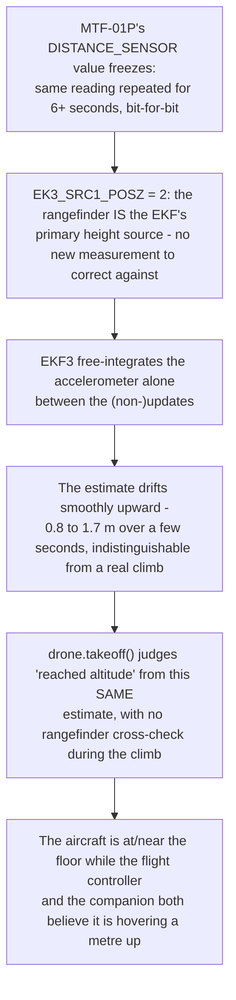

# The rangefinder freezes mid-climb — the EKF believes it, the aircraft does not

On 22 September 2026 the team flew five real milestone-2 attempts (climb, hold,
land — no search, no detector). The first was aborted by the pilot when the aircraft
sank back toward the floor and then rocked as if about to tip; the following four,
flown after two parameter changes aimed at the same symptom, still showed the same
signature in three of four cases. This page is the dataflash-log analysis: what
actually happened, why it is not the parameters the team already tried, and what in
the companion's own code let it fly on the bad estimate without noticing.

## TL;DR

## What five real flights actually show

Every number below comes from the flight controller's own dataflash log (not the
companion's log), read field by field: `RFND.Dist` (the raw rangefinder, logged
independently of what the EKF does with it), `CTUN.Alt`/`CTUN.DAlt` (the EKF-fused
altitude the position controller actually flies on), and `XKF3.IPD` (the EKF's own
innovation — measurement minus prediction — for the vertical position state, which is
the direct evidence of whether the filter is correcting itself against the sensor or
not).

| Flight | Duration | Rangefinder (ground truth) | EKF altitude (`CTUN.Alt`) | Innovation (`XKF3.IPD`) | Outcome |
|---|---|---|---|---|---|
| `5.log` | ~7 s | Real dynamic climb-then-sink: 0.02 → 0.29 m → back to 0.02–0.06 m | Climbs smoothly to **1.68 m**, never comes down | Grows to **−1.04**, never recovers | Pilot saw it sink and start rocking (roll/pitch grew to 4–6°) and disarmed manually |
| `1.log` | ~12.6 s | Real dynamic climb: 0.02 → 0.76 m, continuously varying | Climbs to 0.89 m, tracking within ~0.1–0.5 m | Peaks at −0.49, then **self-corrects** back to −0.2 | Landed normally; a separate mid-flight compass yaw reset (see [Loiter drifts in the hall](hall-magnetics.md)) grew roll to 5° right at the end |
| `2.log` | ~5.8 s | **Frozen at 0.02 m** for most of the flight (bit-for-bit identical) | Climbs to 0.80 m while the sensor shows no motion at all | Grows to −0.60, does not recover in time | A violent attitude excursion (roll swung to 6.4°, pitch −3.3→2.9°) around the point the frozen value briefly "unstuck"; pilot hit the disarm switch |
| `3.log`, 1st attempt | ~8.4 s | **Frozen at 0.02 m** for the entire flight | Climbs to 0.80 m | Grows to −0.62, no recovery | Landed before it got worse |
| `3.log`, 2nd attempt | ~9.6 s | **Frozen at 0.02 m for 6+ consecutive seconds**, briefly live for ~0.7 s around t=7.3 s, then frozen again | Climbs to 0.83 m, target overshoots to 1.32 m | Grows to −0.65, no recovery | The team's most promising-looking flight: it visually climbed, held, and (via a milestone-tag mix-up) flew into `SEARCH` — but the rangefinder was frozen the entire time |

The last row is the important one for the team's own read on the day: the aircraft
almost certainly did climb — battery current during the frozen window reached 17 A,
current only a genuinely lifting aircraft draws, and current draw is measured
independently of the EKF — but that is exactly the point: **the FC's own reported
altitude cannot be trusted as evidence either way in these flights.** It reads the
same "climbing nicely" curve whether or not the rangefinder is telling it anything
true.

## The proof it is the sensor, not the EKF's math

Two facts, independent of each other, rule out an EKF fusion-tuning problem:

1. **The raw value is not just low — it is exactly, repeatedly, identical.** In the
   3.log second attempt, `RFND.Dist` reads exactly `0.02` for more than 100
   consecutive samples at the dataflash log's ~20 Hz rate, over 6 continuous seconds.
   A live sensor sitting even perfectly still has measurement noise; a value frozen
   to the last digit for that long is a stale reading being re-reported, not a fresh
   one.
2. **The team already tried the two parameters that would fix an EKF trust problem,
   and it did not help.** Between the `5.log` attempt and the following four,
   `RNGFND1_GNDCLEAR` was corrected `10 → 5` and `EK3_RNG_M_NSE` (the rangefinder's
   assumed measurement noise) was tightened `0.5 → 0.2` — telling the filter to
   trust the rangefinder *more*, not less. The divergence still recurred in three of
   the four flights made afterwards. Trust-tuning cannot fix a sensor that is not
   sending anything new to trust.

Both parameter changes are real and are now published in
[`Pi-Code/params/flight_v3.param`](https://github.com/ki-drohnen-ss26/Pi-Code/blob/main/params/README.md)
— they were reasonable things to try, and are staying, but they were treating the
wrong layer of the problem.

## Why a frozen height source makes the EKF climb, specifically

`EK3_SRC1_POSZ = 2` means the rangefinder does not merely *correct* the height
estimate, it **is** the primary vertical position source (see
[Position & Altitude Hold](../autopilot/position-altitude-hold.md)). Between
genuine updates, the filter still has to produce an estimate every cycle, so it
integrates the accelerometer forward in time — normal, short-term-accurate dead
reckoning that ordinarily gets pulled back to truth by the next real rangefinder
sample a few dozen milliseconds later. If that correction never arrives because the
input is frozen, there is nothing to pull it back, and pure accelerometer
integration drifts unboundedly, in exactly the smooth, monotonic way `CTUN.Alt` shows
in every affected flight: not a spike, not noise, a plausible-looking climb to
nowhere.

This is the same class of failure as the [2026-08-21 crash](incident-analysis-2026-08-21.md)
(rangefinder-sourced EKF height diverging from reality while every sensor still looks
healthy) — the mechanism inside the EKF is identical. What differs is the trigger:
the crash was a stale *parameter* (a leftover fence) compounding a diverged estimate
that had hours to grow on the ground; this is a live sensor *dropout* during an
actual climb, caught within seconds because the pilot was watching and because,
this time, `ARMING_CHECK` and the fence were both correctly configured.

## What let the aircraft fly on it anyway — the companion's blind spot

The mission's own failsafe already had a purpose-built check for exactly this
symptom, added after the August crash:
`FailsafeMonitor.altitude_implausible()` compares the EKF altitude the FC reports
against the raw rangefinder every second, and aborts after several consecutive
disagreements past `alt_disagree_max_m`. It never fired in any of these five
flights, for two compounding reasons, both now fixed:

1. **It was never being asked the question during the climb.** `mission.py`'s
   `_takeoff()` calls the blocking `drone.takeoff()` and only runs `failsafe.check()`
   once that call returns — but `drone.takeoff()`'s own loop judged "altitude
   reached" purely from `pos["rel_alt"]` (the same diverging EKF number), with no
   rangefinder cross-check anywhere inside it. Every one of these divergences
   happened *during* that unmonitored climb window.
2. **The threshold was calibrated for a different flight envelope.** `alt_disagree_max_m`
   was `2.0` m. The worst divergence actually measured across all five flights was
   ~1.66 m (`5.log`) — it would not have crossed even a continuously-running check.
   At the indoor bring-up altitudes these milestones fly (0.8–1.2 m, with the
   project's own success bar being "drift of centimetres, not metres" — see
   [Mission Planning](../autopilot/mission-planning.md)), a 2 m tolerance could not
   distinguish a real hover from the aircraft sitting on the floor.

**Both are fixed as of 2026-09-22:** `drone.takeoff()` now runs the same
EKF-vs-rangefinder comparison on every iteration of its own climb loop, using the
same `alt_disagree_max_m`/`alt_disagree_samples` config knobs as the continuous
failsafe check, and stops the climb the moment it trips instead of only checking
once, afterwards. `alt_disagree_max_m` is tightened `2.0 m → 0.5 m`. Both changes
only make the aircraft abort *earlier* on a real divergence; neither can make a good
flight fail, and a fresh SITL milestone-2 run and the existing 90-test suite both
stay green under the tighter threshold.

## Status

**The software blind spot is closed. The hardware root cause is still open.**
Why the MTF-01P's data freezes mid-flight — a marginal serial connection disturbed by
motor vibration/EMI, a brownout on its power rail during the ~17 A current peaks
measured in these logs (main-pack voltage sags ~0.8–1 V under that load), or the
sensor module itself stalling internally — has not been isolated yet; all three
remain plausible and none has been physically ruled out. The concrete next steps are
hardware, not code: secure and re-inspect the FC↔MTF-01P serial connector under
vibration, verify the sensor's supply rail holds up through a full-throttle current
peak, and check whether the MicroAir configuration tool exposes any link-health
counter that would distinguish "sensor stalled" from "messages lost in transit."

Until then, the mission code now refuses to fly on the resulting bad estimate instead
of silently completing a climb that never happened — which is the most this session
could fix without opening the aircraft back up.

## Read on

- [Full incident analysis (2026-08-21)](incident-analysis-2026-08-21.md) — the same
  EKF-diverges-from-rangefinder mechanism, first documented after the crash.
- [Position & Altitude Hold](../autopilot/position-altitude-hold.md) — how
  `EK3_SRC1_POSZ` and the rangefinder height source work.
- [Flight Parameters](../autopilot/parameters.md) and the
  [Pi-Code params README](https://github.com/ki-drohnen-ss26/Pi-Code/blob/main/params/README.md) —
  `flight_v3.param` and what changed in it.
