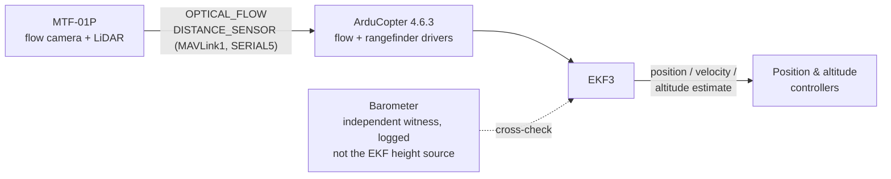

# Sensor Integration

Task 4 covers the sensing that makes autonomous **indoor** flight possible at all.
Outdoors, ArduPilot leans on GPS for position and velocity and on the barometer for
altitude. Indoors, GPS is gone — and with it every mode that needs a position estimate:
Loiter, Guided, RTL, automatic missions. The drone can still be flown manually in
Stabilize, but our mission (fly a search pattern, centre over a pad, drop) needs the
autopilot to *know where it is* without a single satellite.

## Why indoor flight needs optical flow + LiDAR

The Extended Kalman Filter (EKF3) fuses whatever sources it is configured to use into
one estimate of position, velocity and attitude. Indoors we replace the missing GPS
with two measurements from a single sensor, the **MicroAir MTF-01P**:

| What GPS provided | Indoor replacement | EKF parameter |
|---|---|---|
| Horizontal velocity | **Optical flow** — a downward camera tracking ground texture | `EK3_SRC1_VELXY = 5` |
| Horizontal position | None (flow is integrated → *relative* position only) | `EK3_SRC1_POSXY = 0` |
| Altitude | **LiDAR rangefinder** (EKF height source, mandated) + barometer as an independent witness in the logs | `EK3_SRC1_POSZ = 2` |

The two halves of the MTF-01P depend on each other: optical flow measures an *angular*
rate (radians per second of ground moving through the image), and turning that into a
velocity in metres per second requires knowing the height above the ground — which is
exactly what the LiDAR rangefinder provides. One without the other is useless for
navigation. The details live on the two subpages:

- **[Optical flow](optical-flow.md)** — how flow works, why it needs texture, light
  and height, and the on-ground chicken-and-egg problem it creates.
- **[LiDAR rangefinder](lidar.md)** — the height-above-ground source, and the hard
  lesson about what it must *not* be used for.
- **[MTF-01P configuration](mtf-01p-configuration.md)** — the complete how-to: sensor
  mode switch, wiring, FC parameters for ArduCopter 4.6.3, and verification.

How the EKF combines these sources into position/altitude hold is described in
[Position & Altitude Hold](../autopilot/position-altitude-hold.md); the sensor
hardware itself is listed under [Hardware → MTF-01P](../hardware/mtf-01p.md).

## How the MTF-01P feeds EKF3

The sensor connects to the flight controller's **SERIAL5** as a MAVLink1 device at
115200 baud and periodically sends two message types:

EKF3 fuses the flow rates (scaled by the rangefinder height) as horizontal velocity,
and — as the assignment mandates — uses the rangefinder as the **only** vertical
position source (`EK3_SRC1_POSZ = 2`). The barometer is logged alongside as an
independent witness against that estimate, never as the EKF height source.

!!! danger "Configuration, not hardware — and it is the mandated configuration"
    Our 2026-08-21 crash was **not** a sensor failure — the MTF-01P performed
    flawlessly in every log (rangefinder status good in 3441/3441 samples, flow
    quality 45–113). The crash was the failure mode of the configuration the assignment
    *mandates*: `EK3_SRC1_POSZ = 2`, the rangefinder as the only EKF height source — on
    the ground EKF3 fused no height and the vertical estimate diverged. We may not switch
    the EKF to the barometer (the task forbids it); we fly `POSZ = 2` under the safety
    protocol and are still investigating why fusion never engaged. Read the
    [incident analysis](../problems/incident-analysis-2026-08-21.md) and the
    [LiDAR page](lidar.md) before changing any `EK3_SRC*` parameter.

## What the sensor cannot do

Understanding the limits is part of the design:

- **No absolute position.** Flow-integrated position drifts; there is no "home" fix.
  Indoors we accept a *relative* estimate and set the EKF origin from the companion
  computer instead.
- **Nothing while grounded.** Flow needs height above ground to be scaled — sitting
  on the floor the EKF has no relative-position estimate yet, so a flow-only vehicle
  can refuse to report itself "ready" forever. Our escape is the pilot flying the
  first metre by hand (`--takeover`); see [Optical flow](optical-flow.md).
- **Needs floor texture and light.** A uniform, dark or glossy floor drops the flow
  quality and with it the velocity estimate.

!!! info "Status"
    The MTF-01P was configured, wired and verified on the real aircraft (healthy
    values measured and logged), and the equivalent SITL setup flew complete indoor
    missions on ArduCopter 4.6.3. The aircraft itself is currently grounded for
    repair of an unrelated barometer/I2C fault after the 2026-08-21 crash, and the
    sensor's frame mount is still to be designed.
