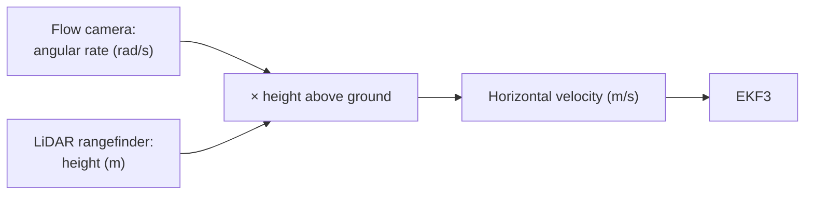

# Optical Flow

Optical flow is the indoor replacement for the GPS **velocity** measurement. A small
downward-facing camera in the [MTF-01P](mtf-01p-configuration.md) watches the floor
and reports how fast the image of the ground moves through its field of view. From
that, the EKF derives the aircraft's horizontal velocity — no satellites involved.

## What the sensor actually measures — and why height is essential

The flow camera does **not** measure a velocity. It measures an **angular rate**: how
many radians per second the ground texture sweeps across the image. The same angular
rate can mean very different speeds:

Move at 1 m/s at 1 m altitude and the ground streams past quickly; move at 1 m/s at
10 m and it barely creeps. To turn the angular rate into metres per second, the EKF
multiplies it by the **height above ground** — which comes from the
[LiDAR rangefinder](lidar.md) on the same module. The two halves of the MTF-01P are
therefore not two independent sensors: **without a valid height, flow data is
unusable**, no matter how good the flow quality is.

## What optical flow needs to work

- **Texture.** The camera tracks features on the floor. A uniform, glossy or very
  dark floor gives it nothing to lock onto and the quality value collapses.
- **Light.** It is a camera; the hall must be lit.
- **Height above ground.** As derived above — a valid rangefinder reading is a hard
  prerequisite, which is also why `RNGFND1_MIN_CM = 1` matters so much
  ([configuration page](mtf-01p-configuration.md)).

**Our measured numbers:** over the hall floor the MTF-01P reported flow `quality`
between **45 and 113** across all our flight logs — that is what "healthy" looks
like on this floor. During the 2026-08-21 flights the flow remained in that band
throughout; the crash had nothing to do with this sensor
([incident analysis](../problems/incident-analysis-2026-08-21.md)).

## How the EKF uses it

On our ArduCopter 4.6.3 setup ([full source table](../autopilot/position-altitude-hold.md)):

| Parameter | Value | Meaning |
|---|---|---|
| `EK3_SRC1_VELXY` | `5` | Horizontal **velocity** from optical flow |
| `EK3_SRC1_POSXY` | `0` | No absolute horizontal position source |

Note what this implies: the EKF only ever gets a *velocity*. Position is that
velocity integrated over time, so it is **relative** (to where the filter started)
and it **drifts** — there is no absolute fix to pull it back. Indoors we accept
this: the companion computer sets the EKF origin itself and the missions are short.

## The chicken-and-egg problem on the ground — and the `--takeover` escape

A flow-only vehicle has a genuine bootstrap deadlock:

1. Optical flow only produces a usable velocity once there is **height above
   ground**.
2. Sitting on the floor there is no height, so the EKF never fuses a flow velocity
   and never reports a relative position estimate (`EKF_POS_HORIZ_REL` stays unset).
3. Our companion software waits for exactly that flag before it arms and takes off —
   so it can wait **forever**. This is not theoretical: it is precisely what
   happened on our 2026-08-20 test day.
4. Without a takeoff there is never a height. Back to 1.

The designed escape is the companion's **`--takeover`** mode: the safety pilot flies
the first metre or two **by hand** (Stabilize needs no position estimate), the flow
gets its height, the EKF converges in the air, and the companion takes over the
mission from there. The handover gate deliberately trusts the **rangefinder** height
and checks that EKF and rangefinder agree — not the EKF altitude alone, a lesson
from the [2026-08-21 incident](../problems/incident-analysis-2026-08-21.md), where the EKF
altitude read over 1000 m *on the floor*.

## Limits to keep in mind

- **Relative position only** — flow-derived position drifts and there is no RTL to a
  surveyed home point.
- **Quality is floor-dependent** — validate the quality value (our band: 45–113)
  over the actual demo floor, not just any floor.
- **A bad height silently poisons the velocity** — a rangefinder stuck at 0.00 m
  does not stop the flow, it mis-scales it; the estimate then drifts while
  everything *looks* alive. In SITL we measured 366 m of position drift on a
  standing vehicle from exactly this. The companion's failsafe checks
  (rangefinder-tracks-altitude after climb, position plausibility in flight) exist
  for this failure mode.

!!! info "Status"
    Flow-based indoor navigation is fully validated in SITL on ArduCopter 4.6.3
    (complete missions flown GPS-off), and the real sensor produced healthy flow
    quality in every hardware log. A flow-navigated flight of the real aircraft is
    still open — the aircraft is grounded for the post-crash barometer/I2C repair.
