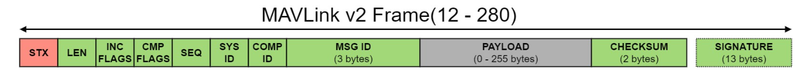
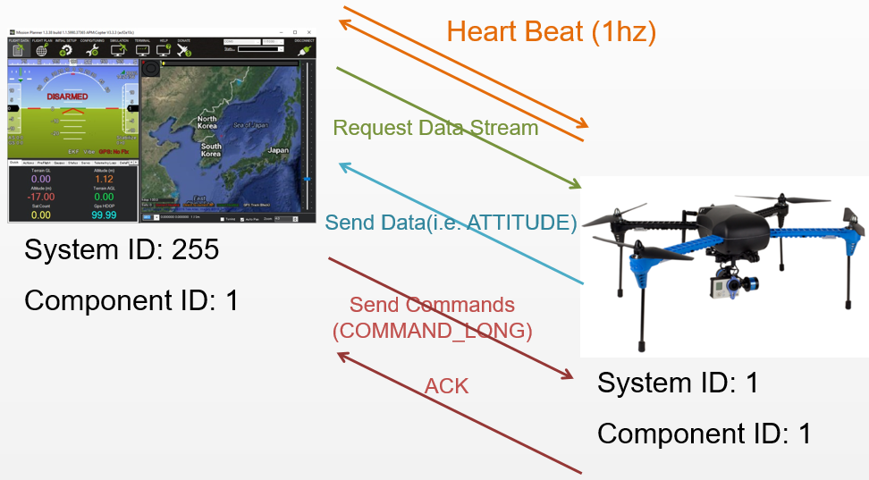

# MAVlink
[MAVLink](https://mavlink.io/en/) is a serial protocol that defines a large set of message and is used to send data and commands between two devices, in our case a drone and either the ground control station or the companion computer. For this section we rely on the information given by [Ardupilot MAVLink](https://ardupilot.org/dev/docs/mavlink-commands.html), as well as official [MAVLink Website](https://mavlink.io/en/) and the official [PyMAVLink Github](https://github.com/ArduPilot/pymavlink?tab=readme-ov-file).

One of the big advatages of the MAVLink protocol is, that the messages can be sent using almost any serial connection, without depending on its underlying technology. They can be sent over serial connection, WiFi, radio or many other technologies.

The [packet format](https://mavlink.io/en/guide/serialization.html) of the MAVLink2 protocol is given as



and we will take a closer look at how the MAVLink messages are constructed.

| Byte Index   | Content                | Explanation                                                                                                                                                                                                                                        |
|--------------|------------------------|----------------------------------------------------------------------------------------------------------------------------------------------------------------------------------------------------------------------------------------------------|
| 0            | Packet start marker    | The first bit in our message defines the beginning of a new packet. It specifies the used protocol, for MAVLink2 it woud be 0xFD, for MAVLink1 0xFE. If the target system does not know the given protocol byte, the whole packet will be skipped. |
| 1            | Payload length         | This byte defines the length of the payload and can be between 0 and 255.                                                                                                                                                                          |
| 2            | Incompatibility Flags  | The incompatibility flag indicates which features the MAVLink library has to support to be able to handle the packet. If the system does not understand the flag, the whole package is discarded                                                   |
| 3            | Compatibility Flags    | The compatibility flags indicate features that are not needed to process the package. The system can ignore the flag in case it does not understand it.                                                                                            |
| 4            | Packet sequence number | This byte signifies the packet sequence. Each sent packet increases the value and can be used to identify package loss.                                                                                                                            |
| 5            | System ID              | This byte defines the system ID of the device that is sending the message and can be used to differentiate different devices on the same network. can take values between 1 and 255. The broadcast address 0 cannot be used.                       |
| 6            | Component ID           | The component ID is used to differentiate different components inside a system that are sending the message. For example one component could be the autopilot, another the camera. While they share a system ID, they differ in the component ID.  |
| 7 to 9       | Message ID             | The Message ID defines the type of message that is send and allows the receiver to decode the data into the correct message object.                                                                                                                |
| 9 + n        | Payload                | The Message data. Can be up to n=255 Bytes.                                                                                                                                                                                                        |
| n+10 to n+11 | Checksum               | A CRC-16/MCRF4XX checksum used to verify that the message is not corrupted.                                                                                                                                                                        |
| n+12 to n+24 | Optional Signature     | A signature that ensures the link is tamper-proof.                                                                                                                                                                                                 |

Because we are using the MAVLink2 protocol, we want to only briefly take a look at MAVLink1. The packet format of MAVLink 2 is a expansion of MAVLink1, that introduced the incompatibility and compatibility flags and signature, and increased the size of the Message ID and the Payload. MAVLink2 is backwards compatible and understands each MAVLink1 message. MAVLink1 on the other hand can only see the original fields, without the added MAVLink2 functionality, meaning messages could be read, but it might lead to problems if MAVLink2 features are used.

The [High Level Message Flow](https://ardupilot.org/dev/docs/mavlink-basics.html), the image directly from Ardupilot, shows us how the communication between two devices work:



Here we see the communication between a Ground control station and a drone, but the same holds true for any two devices that communicate using the MAVLink protocol.

After a connection is opened, the systems send a HEARTBEAT message at a frequency of 1Hz, meaning one message each second, to each other to show that the other system is present and able to respond.

Then the ground control station or board computer, can request data and the rate at which the data should be sent, and the drone in return send the data back.

The ground control station can also send commands, which is what we are mostly interested in for the autonomous flight, where the drone send an acknowledgement back, that the command was received.

## MAVLink commands
In this section we will look at some MAVLink messages that are needed for our autonomous flight, but it is only a small subset of all possible Messages, which we can find under [Ardupilot MAVLink Messages](https://ardupilot.org/copter/docs/ArduCopter_MAVLink_Messages.html#arducopter-mavlink-messages).

### Heartbeat(0)
The first message we will look at is the Hearbeat, where we will show how the full serialized message looks like, in further we will only concentrate on the important points, mainly the payloads.

The Heartbeat is defined in the [MAVLink Minimal Message Set](https://mavlink.io/en/messages/minimal.html#HEARTBEAT), that contains the minimal set of definitions needed for a viable MAVLink system, and is also included in the [Commons Set](https://mavlink.io/en/messages/common.html#HEARTBEAT), that includes standard definitions managed by the MAVLink project.

The message ID for the Heartbeat is defined as 0, and the payload contains the following information:

| Field Name      | Type       | Values                                                                    | Description                                                                                                                                                                                                                                                                          |
|-----------------|------------|---------------------------------------------------------------------------|--------------------------------------------------------------------------------------------------------------------------------------------------------------------------------------------------------------------------------------------------------------------------------------|
| type            | `uint8_t`  | [MAV_TYPE](https://mavlink.io/en/messages/common.html#MAV_TYPE)           | The first byte inside the payload defines the type of vehicle we use or the type of the component used. The linked [MAV_TYPE](https://mavlink.io/en/messages/common.html#MAV_TYPE) has the types and corresponding integer values liste. For example the quadcoptor has the value 2. |
| autopilot       | `uint8_t`  | [MAV_AUTOPILOT](https://mavlink.io/en/messages/common.html#MAV_AUTOPILOT) | This defines the autpilot class, for example it could be a form of ardupilot or PX4                                                                                                                                                                                                  |
| base_mode       | `uint8_t`  | [MAV_MODE_FLAG](https://mavlink.io/en/messages/common.html#MAV_MODE_FLAG) | This is a bitmask that encodes the MAV mode, it shows for example, that the vehicle has Stabilize mode or Guided mode enabled.                                                                                                                                                       |
| custom_mode     | `uint32_t` |                                                                           | These four byte are used for flags that are specific to the given autopilot                                                                                                                                                                                                          |
| system status   | `uint8_t`  | [MAV_STATE](https://mavlink.io/en/messages/common.html#MAV_STATE)         | This byte contains the system status flag and shows the current status, for example if the system is currently booting, or if it is calibrating, etc.                                                                                                                                |
| mavlink_version | `uint8_t`   |                                                                           | This byte is not wrieable by users,but gets added by the protocol and denotes the version.                                                                                                                                                                                           |

Now we can look at an actual example, where we have the following values:

| Field Name      | Example Value                                       |
|-----------------|-----------------------------------------------------|
| type            | MAV_TYPE_QUADROTOR (02)                             |
| autopilot       | MAV_AUTOPILOT_ARDUPILOTMEGA (03)                    |
| base_mode       | custom mode enabled + stabilize + manual input (51) |
| custom_mode     | Arducopter LOITER (05 00 00 00)                     |
| system_status   | MAV_STATE_STANDBY (03)                              |
| mavlink_version | 03                                                  |

These make up our payload, but the field reordering sorts by native size, where the largest is the first, meaning the custom_mode, that has 4 bytes, is set at the beginning, resulting in our payload:
```payload: 05 00 00 00 02 03 51 03 03```

The full MAVLink2 looks like this:

```FD 09 00 00 2A 01 01 00 00 00 05 00 00 00 02 03 51 03 03 AD 01```

Looking at each entry:

| Content               | Value                      | Note                                                                                       |
|-----------------------|----------------------------|--------------------------------------------------------------------------------------------|
| Start marker          | FD                         | Denotes MAVLink2                                                                           |
| Payload length        | 09                         | Payload has 9 bytes                                                                        |
| Incompatibility Flags | 00                         | No Incompatibility Flags                                                                   |
| Compatibility Flags   | 00                         | No Compatibility Flags                                                                     |
| Packet Sequence       | 2A                         | 42nd Message                                                                               |
| System ID             | 01                         | Generally ID 1 is used for the drone                                                       |
| Component ID          | 01                         | Component ID 1 is mostly used for the autopilot                                            |
| Message ID            | 00 00 00                   | The Message ID of the HEARTBEAT is 0. Do note that this fields byte-order is little endian |
| Payload               | 05 00 00 00 02 03 51 03 03 |                                                                                            |
| Checksum              | AD 01                      | CRC-16/MCRF4XX                                                                             |
| Signature             | -                          | Optional Signature was omitted                                                             |

With that we have created our first MAVLink message. As we have seen how MAVLink messages basically work, we will mainly look at the payload for our further commands.

### Command_Long (76)
[Command_Long](https://mavlink.io/en/messages/common.html#COMMAND_LONG) is the most important message, that sends a command and up to seven parameters as `float` types to the target system and is the most common message that is used by ardupilot to send the commands we need for our autonomous flight. 

The message ID is 76, and the payload has the following fields 

| Field Name       | Type      | Description                                                                                                                                                          |
|------------------|-----------|----------------------------------------------------------------------------------------------------------------------------------------------------------------------|
| target_system    | `uint8_t` | Dentotes the system that is supposed to run the command                                                                                                              |
| target_command   | `uint8_t` | Denotes the component that should run the command. If the option is 0, the commands is executed on all components                                                    |
| command          | `uint8_t` | These two bytes define the command ID of [MAV_CMD](https://mavlink.io/en/messages/common.html#mav_commands)                                                          |
| confirmation     | `uint8_t` | The confirmation byte shows how often the command was used without receiving acknowledgement. The first transmition is value 0, each following increments the value. |
| param1 to param7 | `float`     | Defines seven possible parameters that are used for the specific command.                                                                                            |

A list of all MAV_CMD can be found as part of the MAVLink common messages under [MAV_CMD](https://mavlink.io/en/messages/common.html#mav_commands)

#### Arm and Disarm
Most commands we are using in ardupilot are based upon the COMMAND_LONG message, setting the appropriate command and needed parameters. 
To fly our drone, we need to be able to arm and disarm our drone. This can be done by the MAV_CMD_COMPONENT_ARM_DISARM command, that has the MAV_CMD ID 400. The payload of the COMMAND_LONG message will look like the following:

| Command Field    | Description                                                                                                        |
|------------------|--------------------------------------------------------------------------------------------------------------------|
| target_system    | The system ID for the target, for drones very often 1                                                              |
| target_component | The component ID of the flight controller, or 0, as other components should not be able to arm or disarm the drone |
| command          | The used command for Disarming is MAV_CMD_COMPONENT_ARM_DISARM (400)                                               |
| confirmation     | Automatically increases value from 0 for each try to send the message.                                             |
| param1           | 0 for disarm or 1 for arm                                                                                          |
| param2           | 0 allows safety checks to override the command, 21196 forces the command                                           |

#### Set Flightmodes
We once again send a COMMAND_LONG to set the flightmodes, using the MAV_CMD: MAV_CMD_DO_SET_MODE (176) and we can give along two parameters. For autonomous flight we need the Guided flight mode. We would get the payload:

| Command Field    | Description                                                                                                                                                                                                     |
|------------------|-----------------------------------------------------------------------------------------------------------------------------------------------------------------------------------------------------------------|
| target_system    | The system ID for the target, for drones very often 1                                                                                                                                                           |
| target_component | The component ID of the flight controller, or 0                                                                                                                                                                 |
| command          | The used command for setting the flight mode is MAV_CMD_DO_SET_MODE (176)                                                                                                                                       |
| confirmation     | Automatically increases value from 0 for each try to send the message.                                                                                                                                          |
| param1           | The first parameter indicates whether the system uses a custom mode that is specific to a certain autopilot. As Ardupilot does use its own custom mode, we set the value to 1                                   |
| param2           | The second parameter takes the flight mode number, defined in [FLTMODE1](https://ardupilot.org/copter/docs/parameters.html#fltmode1) some commonly used flight modes are Stabilize(0), AltHold(2) and Guided(4) |

#### Guided Mode 
There are some COMMAND_LONG commands that are created especially for the guided mode of the drone, which can be found in the official Ardupilot documentation of [Copter Commands in Guided Mode](https://ardupilot.org/dev/docs/copter-commands-in-guided-mode.html) 

We will look at some that are helpful to our autonomous flight.

##### Takeoff
The Takeoff command MAV_CMD_NAV_TAKEOFF (22) handles the takeoff from ground for our drone to a specified altitude. If the drone is already flying, it will climb to the specified altitude, and if it is above the defined altitude, the command will just be ignored


| Command Field    | Description                                                                                                   |
|------------------|---------------------------------------------------------------------------------------------------------------|
| target_system    | The system ID for the target, for drones very often 1                                                         |
| target_component | The component ID of the flight controller, or 0                                                               |
| command          | The used command for takeoff is MAV_CMD_NAV_TAKEOFF (22)                                                      |
| confirmation     | Automatically increases value from 0 for each try to send the message.                                        |
| param1           | The first parameter is onyl available for planes in Ardupilot and sets the minimum pitch/climb angle          |
| param2           | The second parameter is left empty (0)                                                                        |
| param3           | Is generally used as Bitmask for option flags, but Ardupilot does not support this. Value will be ignored (0) |
| param4           | Defines the YAW angle for the drone                                                                           |
| param5           | Defines Latitude                                                                                              |
| param6           | Defines Longitude                                                                                             |
| param7           | Altitude                                                                                                      |

In virtually all Drone use cases, only the Altitude parameter is set.

##### Land
If we can take off, we obviously will have to land the drone as well, this can be done using the MAV_CMD_NAV_LAND (21) command.

While MAVLink offers the MAV_CMD_NAV_LAND command, Ardupilot just uses it to change the flight mode to Land, which we already coverd in the section about changing flight modes


##### Change Yaw
To change the yaw of the drone we can use the MAV_CMD_CONDITION_YAW (115) to rotate the drone and point its nose to a specific direction. Both absolute and values relative to the current direction are allowed.
The payload looks like the following:

| Command Field    | Description                                                                                                                                                                                                                                            |
|------------------|--------------------------------------------------------------------------------------------------------------------------------------------------------------------------------------------------------------------------------------------------------|
| target_system    | The system ID for the target, for drones very often 1                                                                                                                                                                                                  |
| target_component | The component ID of the flight controller, or 0                                                                                                                                                                                                        |
| command          | The used command for takeoff is MAV_CMD_CONDITION_YAW (115)                                                                                                                                                                                            |
| confirmation     | Automatically increases value from 0 for each try to send the message.                                                                                                                                                                                 |
| param1           | Depending on the fourth parameter, there will either be a absolute Degree between 0 and 360, where 0 denotes the North. If we use the param4 option for relative change, the change  from the current yaw value is given in degrees                    |
| param2           | The second parameter idenotes the speed the drone is rotating. The unit is degree per second.                                                                                                                                                          |
| param3           | The third parameter denotes the direction of roation to achieve the target angle. -1 rotates counter clockwise and 1 clockwise. If we are working with absolute values, using 0 will choose the direction that achieves the target angle the quickest. |
| param4           | For 0, the command will use absolute direction and 1 will use relative direction.                                                                                                                                                                      |
### Guided Mode Messages
There are also some [Commands in Guided Mode](https://ardupilot.org/dev/docs/copter-commands-in-guided-mode.html) that can be used to control the Vehicles position, velocity or attitude, which we will look at in this section

#### SET_POSITION_TARGET_LOCAL_NED (84)
The SET_POSITION_TARGET_LOCAL_NED command allows us to either set a target position as offset in NED (North, East, Down) based on the EKF orign, the velocity, acceleration, heading or turnrate of the drone. 

The payload of the command looks as followed:

| Field Name       | Type       | Description                                                                                                                                                                                                                                                                                                                                                                                                                                                                                                                                                                                                                                                                                                                                                                                                                                                                                                                                                                                 |
|------------------|------------|---------------------------------------------------------------------------------------------------------------------------------------------------------------------------------------------------------------------------------------------------------------------------------------------------------------------------------------------------------------------------------------------------------------------------------------------------------------------------------------------------------------------------------------------------------------------------------------------------------------------------------------------------------------------------------------------------------------------------------------------------------------------------------------------------------------------------------------------------------------------------------------------------------------------------------------------------------------------------------------------|
| time_boot_ms     | `uint32_t` | This field contains the senders system time in milliseconds since boot.                                                                                                                                                                                                                                                                                                                                                                                                                                                                                                                                                                                                                                                                                                                                                                                                                                                                                                                     |
| target_system    | `uint8_t`  | The System ID of the drone                                                                                                                                                                                                                                                                                                                                                                                                                                                                                                                                                                                                                                                                                                                                                                                                                                                                                                                                                                  |
| target_component | `uint8_t`  | The component ID of the flight controller                                                                                                                                                                                                                                                                                                                                                                                                                                                                                                                                                                                                                                                                                                                                                                                                                                                                                                                                                   |
| coordinate_frame | `uint8_t`  | There are four possible values for the coordinate frame, that define whether the positions are relative to either the drones EKF Origin, or the vehicles position and whether the velocity and acceleration are defined using the NED frame, or if they are relative to where the drone is heading.<br/> 1. MAV_FRAME_LOCAL_NED (1): The positions are relative to the EKF origin in NED frame and the velocity and acceleration are in NED frame as well<br/> 2. MAV_FRAME_LOCAL_OFFSET_NED (7): The positions are relative to the drones current position and the velocity and acceleration are in NED frame <br/> 3. MAV_FRAME_BODY_NED (8): Positions are relative to the EKF origin in NED frame and the velocity and acceleration are relative to the heading of the drone<br/> 4. MAV_FRAME_BODY_OFFSET_NED (9): The positions are relative to the drones current position and heading in NED frame. The velocity and acceleration are also relative to the current vehicle heading. |
| type_mask        | `uint16_t` | This Bitmask indicates which fields are ignored by the drone. The details are given beneath the table.                                                                                                                                                                                                                                                                                                                                                                                                                                                                                                                                                                                                                                                                                                                                                                                                                                                                                      |
| x                | `float`    | Gives the X position in metres, positive values go towards the north.                                                                                                                                                                                                                                                                                                                                                                                                                                                                                                                                                                                                                                                                                                                                                                                                                                                                                                                       |
| y                | `float`    | Gives the Y position in metres, positive values go towards the east.                                                                                                                                                                                                                                                                                                                                                                                                                                                                                                                                                                                                                                                                                                                                                                                                                                                                                                                        |
| z                | `float`    | Gives the Z position in metres, positive values go downward.                                                                                                                                                                                                                                                                                                                                                                                                                                                                                                                                                                                                                                                                                                                                                                                                                                                                                                                                |
| vx               | `float`    | Velocity in X direction (North or forward where the drone is heading)                                                                                                                                                                                                                                                                                                                                                                                                                                                                                                                                                                                                                                                                                                                                                                                                                                                                                                                       |
| vy               | `float`    | Velocity in Y direction (East or to the right in regards to where the drone is heading)                                                                                                                                                                                                                                                                                                                                                                                                                                                                                                                                                                                                                                                                                                                                                                                                                                                                                                     |
| vz               | `float`    | Velocity in Z direction (positive velocity points downwards)                                                                                                                                                                                                                                                                                                                                                                                                                                                                                                                                                                                                                                                                                                                                                                                                                                                                                                                                |
| afx              | `float`    | Acceleration in X direction (North or forward)                                                                                                                                                                                                                                                                                                                                                                                                                                                                                                                                                                                                                                                                                                                                                                                                                                                                                                                                              |
| afy              | `float`    | Acceleration in Y direction (east or to the right)                                                                                                                                                                                                                                                                                                                                                                                                                                                                                                                                                                                                                                                                                                                                                                                                                                                                                                                                          |
| afz              | `float`    | Acceleration in Z direction (positive points downwards)                                                                                                                                                                                                                                                                                                                                                                                                                                                                                                                                                                                                                                                                                                                                                                                                                                                                                                                                     |
| yaw              | `float`    | yaw or heading in radians (0 is forward or North)                                                                                                                                                                                                                                                                                                                                                                                                                                                                                                                                                                                                                                                                                                                                                                                                                                                                                                                                           |
| yaw_rate         | `float`    | yaw rate in rads/s                                                                                                                                                                                                                                                                                                                                                                                                                                                                                                                                                                                                                                                                                                                                                                                                                                                                                                                                                                          |


Here we want to look a little closer at the type_mask, and will give the different bits and what they indicate. If the bit is set to 1, the value that are reffered to will be ignored.

| Bit | Ignored Field                                                      |
|-----|--------------------------------------------------------------------|
| 1   | Position X                                                         |
| 2   | Position Y                                                         |
| 3   | Position Z                                                         |
| 4   | Velocity X                                                         |
| 5   | Velocity Y                                                         |
| 6   | Velocity Z                                                         |
| 7   | Acceleration X                                                     |
| 8   | Acceleration Y                                                     |
| 9   | Acceleration Z                                                     |
| 10  | Use force instead of acceleration. 1 for force, 0 for acceleration |
| 11  | yaw                                                                |
| 12  | yaw rate                                                           |

Lets look at a few examples, if we only want to change the position, we use

```Use Position: Binary : 0b110111111000; Decimal : 3576```

In case we only want to use velocity we use

```Use Velocity: Binary : 0b110111000111; Decimal : 3527```

and for acceleration:

```Use Acceleration: Binary : 0b110000111111; Decimal : 3135```

We can use any combination we want, even though not all might be useful.
