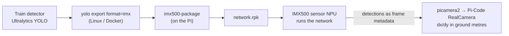

# AI Software

The drone finds its drop target visually: a neural network detects the landing pad in
the downward camera image and the companion converts the detection into approach
commands. The defining constraint is *where* that network can run — and on a Raspberry
Pi Zero 2 W the answer is: **not on the CPU**.

## Why the network runs on the sensor

The Pi Zero 2 W's four Cortex-A53 cores are fully occupied being a flight companion —
pymavlink at telemetry rate, the failsafe monitor, logging. Running a YOLO-class
detector on that CPU beside MAVLink is not feasible at any useful frame rate; the usual
answer, TensorFlow Lite, is exactly the option we evaluated and rejected below.

Our camera is the **Raspberry Pi AI Camera** built on the **Sony IMX500** — an image
sensor with a neural-network accelerator *on the sensor die itself*. The network
executes there, and the Pi receives each frame **together with the inference results as
frame metadata**. The Pi's CPU cost for "AI" is effectively parsing a metadata
structure. Physical installation and firmware setup of the camera:
[Raspberry Pi AI Camera](../hardware/ai-camera.md).



## The model path: from training to `.rpk`

!!! danger "The IMX500 does not load `.tflite` files"
    The sensor's NPU only executes Sony's packaged **`.rpk`** format. A `.tflite` file
    is a *CPU* model format — handing it to the IMX500 stack simply does not work, and
    running it on the Pi CPU instead defeats the entire point of the camera. Every
    trained model must go through the export/packaging chain below.

1. **Train** the detector with Ultralytics YOLO on the pad dataset (any machine with a
   GPU).
2. **Export for the IMX500** — on Linux (or in Docker), because the converter
   toolchain is Linux-only:
   ```bash
   yolo export model=<trained>.pt format=imx data=<dataset>.yaml
   ```
   This quantises the network and produces a `packerOut.zip`.
3. **Package on the Pi** into the deployable firmware blob:
   ```bash
   imx500-package -i packerOut.zip -o ~/models/pad
   ```
   `imx500-package` is installed by the `imx500-all` apt package
   ([camera setup](../hardware/ai-camera.md)), and the result is the `network.rpk`
   the sensor loads.

## Reading detections: picamera2

`picamera2` is the Python camera stack that integrates the IMX500: it loads the `.rpk`
onto the sensor and delivers the inference output tensors as **metadata attached to
each frame**. Pi-Code's `RealCamera` sits on top of that and does two non-obvious
conversions before the mission sees anything:

- **Box order is a config value, not a constant.** The IMX500/picamera2 samples emit
  boxes as `(y0, x0, y1, x1)` normalised to 0..1, while Ultralytics `format=imx`
  exports have been seen emitting `(x0, y0, x1, y1)` in input-tensor pixels.
  `config.cam_box_order` selects the convention, and `RealCamera` logs the first raw
  box next to its decoded form so the choice can be verified on the bench before any
  flight.
- **Detections become ground metres.** The mission logic is tuned in metres (it was
  validated in SITL against a metre-reporting simulated camera), so `RealCamera`
  converts the image-fraction offset via `tan(fraction × FOV/2) × height`, using the
  drone's current height above ground.

The full calibration procedure (axis mapping, sign checks, FOV) is in the Pi-Code repo:
[`docs/SIM_TO_REAL.md` §3/3a](https://github.com/ki-drohnen-ss26/Pi-Code/blob/main/docs/SIM_TO_REAL.md).

## Why not TensorFlow Lite on the Pi?

TensorFlow Lite (LiteRT) is the standard way to run a quantised detector on a plain
Raspberry Pi, and it is the right choice on a Pi 4/5 or when no accelerator hardware
exists. We did not use it because on a **Zero 2 W** the CPU budget is already spent on
the flight-critical companion tasks — a CPU detector would either starve the MAVLink
loop or run at a frame rate too low for visual servoing. The IMX500 moves the entire
inference off the Pi, which is why the *only* deployable model format for us is the
`.rpk`, not the `.tflite` the training pipeline naturally produces first.

## Detector status

!!! success "Status (2026-08-24): the `.rpk` exists and is measured"
    The re-export is **done**. The deployed detector is a single-class YOLO11n
    (`landingPad`, 320 px), and both artefacts exist:

    - **`pad_320_int8.tflite`** — the CPU model, kept only as a reference for the
      comparison above;
    - **`network.rpk`** — the IMX500 package, built 2026-08-19 via
      `packerOut.zip` → `imx500-package`. The ARM-only packaging step runs on a free
      `ubuntu-24.04-arm` GitHub Actions runner, so no Pi has to be powered on for it.

    Quantisation was measured rather than assumed: **mAP50 0.9950 and recall 1.000
    unchanged**, only mAP50-95 falls 0.8098 → 0.6737 (looser boxes, same detections).

    **What is still outstanding** is deployment and bench verification, not the model:
    copy the `.rpk` to the Pi, switch `camera_source` from `"timed"` to `"real"`, and
    set the two values the measurements call for — `cam_box_order = "xyxy"` and
    `camera_confidence = 0.3`. Until milestone 2 has confirmed the decoded `dx`/`dy`
    against a tape measure, the companion should keep flying `"timed"`.

    Full write-up: **[Landing Pad Detection](../landing-pad/index.md)** —
    [deployment](../landing-pad/deployment.md) and
    [flight-code integration](../landing-pad/integration.md).

## Where to go next

- [Landing Pad Detection](../landing-pad/index.md) — the detector itself: dataset,
  training runs, robustness measurements, both deployment paths, and the contract
  with the flight code
- [Raspberry Pi AI Camera](../hardware/ai-camera.md) — connecting the camera, IMX500
  firmware install, first detection demo
- [Raspberry Pi OS](raspberry-pi-os.md) — the OS the stack runs on
- [Pi-Code `docs/SIM_TO_REAL.md`](https://github.com/ki-drohnen-ss26/Pi-Code/blob/main/docs/SIM_TO_REAL.md)
  — camera axis calibration and the `RealCamera` implementation notes
