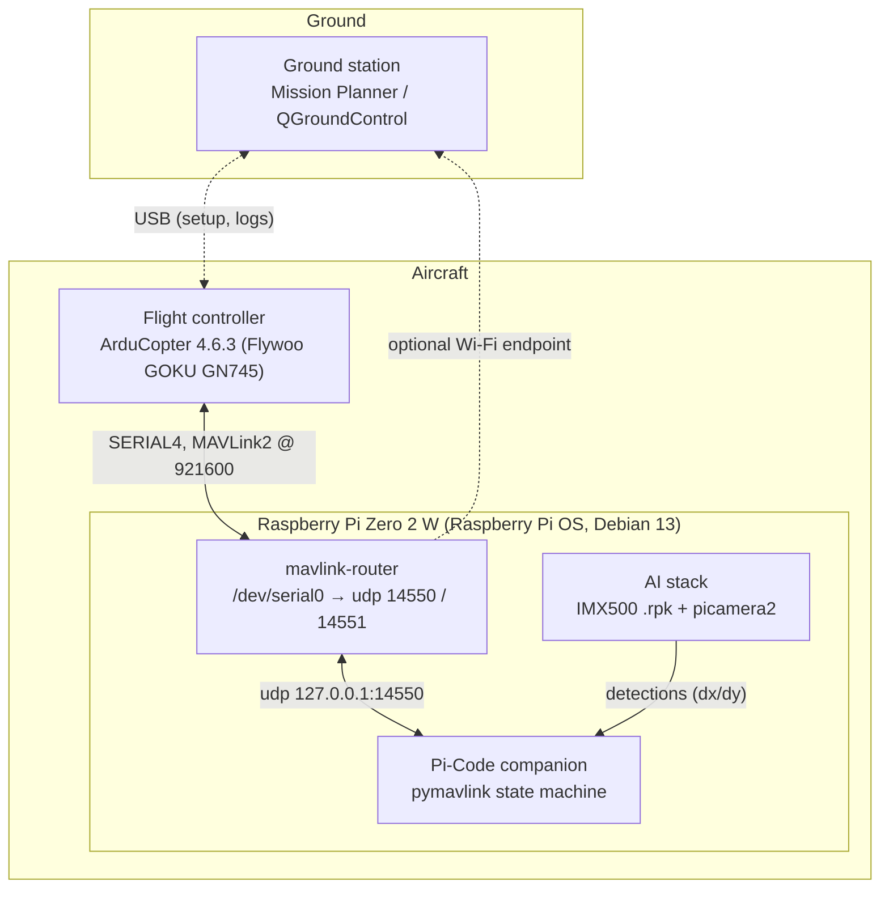

# Software Overview

The drone is flown by **five cooperating software layers**: the autopilot firmware on the
flight controller, a ground station for setup and diagnosis, the operating system and
MAVLink routing on the Raspberry Pi, our own companion mission code, and the AI stack
that runs the pad detector on the camera sensor itself. A sixth piece — the SITL
simulator — is not on the aircraft at all, but every mission is rehearsed against it
before it touches hardware.

## The layers

| Layer | What it does | Page |
|---|---|---|
| **Flight controller firmware** | ArduCopter **4.6.3** (pinned) on the Flywoo GOKU GN745 AIO. Provides the EKF state estimation, GUIDED mode and the MAVLink interface the companion depends on. | [Flight Controller Firmware](flight-controller.md) |
| **Ground station (GCS)** | Mission Planner (our main tool) and QGroundControl — parameter management, the Messages tab, dataflash log download. Not part of the autonomous loop, indispensable for everything around it. | [Ground Control Station](gcs.md) |
| **Pi OS + MAVLink routing** | Raspberry Pi OS (Debian 13 *trixie* base) with the UART freed for the FC link and **mavlink-router** as a systemd service fanning the FC stream out to local UDP consumers. | [Raspberry Pi OS](raspberry-pi-os.md) |
| **Companion mission code** | The [**Pi-Code** repository](https://github.com/ki-drohnen-ss26/Pi-Code): a pymavlink state machine (IDLE → TAKEOFF → SEARCH → APPROACH → DROP → RECOVER) with failsafe monitor, staged bring-up milestones 1–5 and a `--takeover` pilot handover. | [Pi-Code README](https://github.com/ki-drohnen-ss26/Pi-Code#readme) |
| **AI stack** | The pad detector runs **on the camera sensor** (Sony IMX500) as a packaged `.rpk`; `picamera2` reads the detections as frame metadata. The Pi CPU stays free for MAVLink. | [AI Software](ai-software.md) |
| **Simulation (SITL)** | ArduPilot Software-in-the-Loop, checked out at the **same tag** the FC runs (Copter-4.6.3). The companion connects to it exactly as it connects to the real drone. | [Setup Simulation](SetupSimulation.md) |

## How the pieces talk

Everything above the flight controller speaks **MAVLink**. The FC's SERIAL4 port runs
MAVLink2 at 921600 baud into the Pi's UART; `mavlink-router` owns `/dev/serial0` and
forwards the stream to `udp 127.0.0.1:14550`, where the mission script binds. A second
endpoint (14551) feeds the `fclog.py` flight recorder, and an optional Wi-Fi endpoint
lets a ground station watch the live aircraft. One FC stream, several independent
consumers — that is exactly what the router is for.

The autopilot-side configuration that makes this work — flight modes, EKF sources for
GPS-denied flight, parameters — is documented in the [Autopilot section](../autopilot/index.md);
the physical Pi↔FC wiring in [Raspberry Pi Zero 2](../hardware/raspberry-pi.md).

## SITL first, hardware second

The single most valuable property of this stack: **the companion code that flies SITL is
byte-for-byte the code that flies the drone.** `python main.py --sim` connects to the
simulator on the same UDP endpoint the router provides on the Pi, so the whole mission
logic, the failsafes and the search patterns are validated on a Mac before the aircraft
is even powered. The differences between the two worlds (drop servo, battery threshold,
camera source) are confined to one config preset and documented in
[Pi-Code `docs/SIM_TO_REAL.md`](https://github.com/ki-drohnen-ss26/Pi-Code/blob/main/docs/SIM_TO_REAL.md);
the component relationships and mission flow are in
[Pi-Code `docs/ARCHITECTURE.md`](https://github.com/ki-drohnen-ss26/Pi-Code/blob/main/docs/ARCHITECTURE.md).

!!! info "Status (2026-08-22)"
    The SITL pipeline and the companion code are fully working, including the GPS-denied
    indoor path on ArduCopter 4.6.3 SITL. On the real aircraft the staged milestones 1–5
    have **not yet been flown** — the drone is grounded pending the barometer/I2C repair
    from the [2026-08-21 incident](../problems/incident-analysis-2026-08-21.md), and the detector's
    `.rpk` export is still pending (see [AI Software](ai-software.md)).
